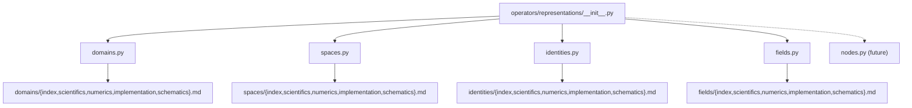
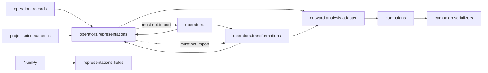
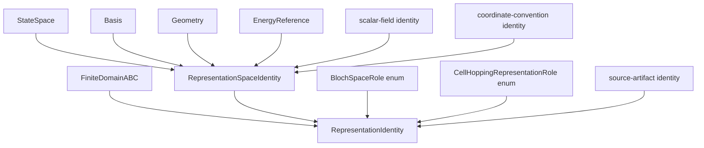
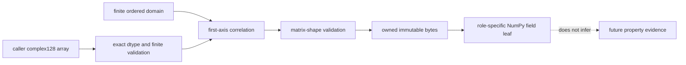
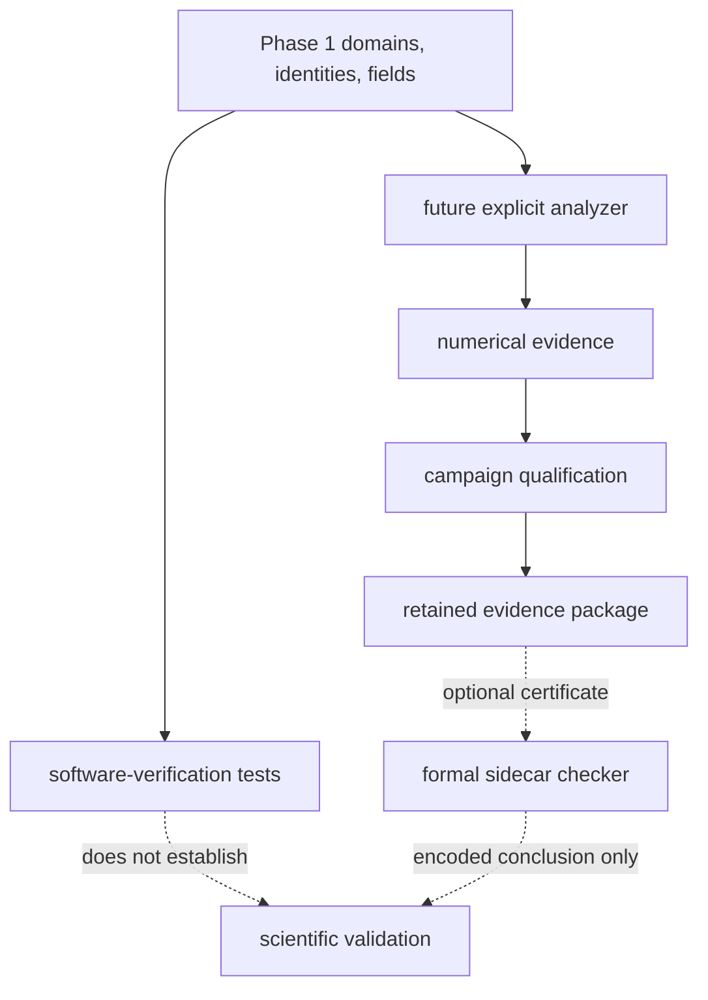

# Schematics

## Source mirror

```mermaid
flowchart TD
    package["operators/representations/__init__.py"]
    domains["domains.py"]
    spaces["spaces.py"]
    identities["identities.py"]
    fields["fields.py"]
    futureNodes["nodes.py (future)"]

    package --> domains
    package --> spaces
    package --> identities
    package --> fields
    package -.-> futureNodes

    domains --> domainsDocs["domains/{index,scientifics,numerics,implementation,schematics}.md"]
    spaces --> spacesDocs["spaces/{index,scientifics,numerics,implementation,schematics}.md"]
    identities --> identitiesDocs["identities/{index,scientifics,numerics,implementation,schematics}.md"]
    fields --> fieldsDocs["fields/{index,scientifics,numerics,implementation,schematics}.md"]
```

## Dependency direction

```mermaid
flowchart LR
    records["operators.records"] --> representations["operators.representations"]
    numerics["projectkoios.numerics"] --> representations
    numpy["NumPy"] --> fields["representations.fields"]
    transformations["operators.transformations"] --> representations
    concrete["operators.<concrete_operator>"] --> representations
    concrete --> transformations

    representations --> adequacy["outward analysis adapter"]
    transformations --> adequacy
    adequacy --> campaigns["campaigns"]
    campaigns --> serializers["campaign serializers"]

    representations -. "must not import" .-> transformations
    representations -. "must not import" .-> concrete
```

## Representation identity composition

```mermaid
flowchart TD
    stateSpace["StateSpace"] --> space["RepresentationSpaceIdentity"]
    basis["Basis"] --> space
    geometry["Geometry"] --> space
    energy["EnergyReference"] --> space
    scalar["scalar-field identity"] --> space
    coordinates["coordinate-convention identity"] --> space

    domain["FiniteDomainABC"] --> node["RepresentationIdentity"]
    space --> node
    blochRole["BlochSpaceRole enum"] --> node
    hoppingRole["CellHoppingRepresentationRole enum"] --> node
    source["source-artifact identity"] --> node
```

## Matrix-field storage flow

```mermaid
flowchart LR
    caller["caller complex128 array"] --> validate["exact dtype and finite validation"]
    domain["finite ordered domain"] --> correlate["first-axis correlation"]
    validate --> correlate
    correlate --> shape["matrix-shape validation"]
    shape --> bytes["owned immutable bytes"]
    bytes --> leaf["role-specific NumPy field leaf"]
    leaf -. "does not infer" .-> evidence["future property evidence"]
```

## Evidence boundary

```mermaid
flowchart TD
    data["Phase 1 domains, identities, fields"] --> software["software-verification tests"]
    data --> futureAnalyzer["future explicit analyzer"]
    futureAnalyzer --> numerical["numerical evidence"]
    numerical --> decision["campaign qualification"]
    decision --> retained["retained evidence package"]
    retained -. "optional certificate" .-> checker["formal sidecar checker"]

    software -. "does not establish" .-> scientific["scientific validation"]
    checker -. "encoded conclusion only" .-> scientific
```
