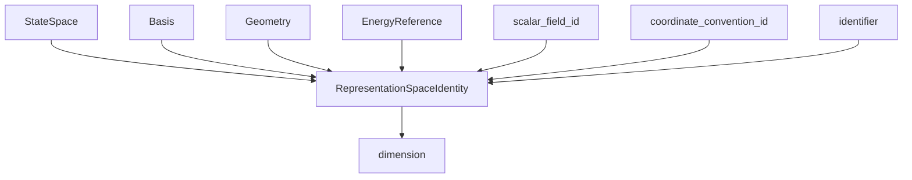
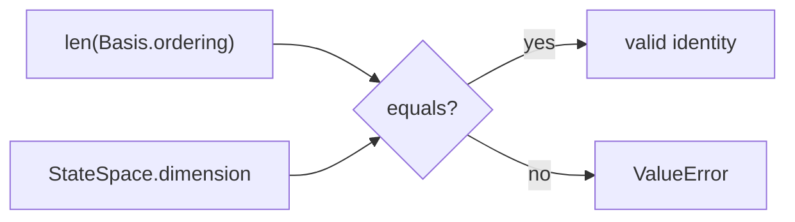

# Schematics

```mermaid
flowchart TD
    state["StateSpace"] --> space["RepresentationSpaceIdentity"]
    basis["Basis"] --> space
    geometry["Geometry"] --> space
    energy["EnergyReference"] --> space
    scalar["scalar_field_id"] --> space
    coordinates["coordinate_convention_id"] --> space
    id["identifier"] --> space
    space --> dimension["dimension"]
```

```mermaid
flowchart LR
    basisCount["len(Basis.ordering)"] --> equality{"equals?"}
    spaceDimension["StateSpace.dimension"] --> equality
    equality -->|yes| valid["valid identity"]
    equality -->|no| reject["ValueError"]
```
