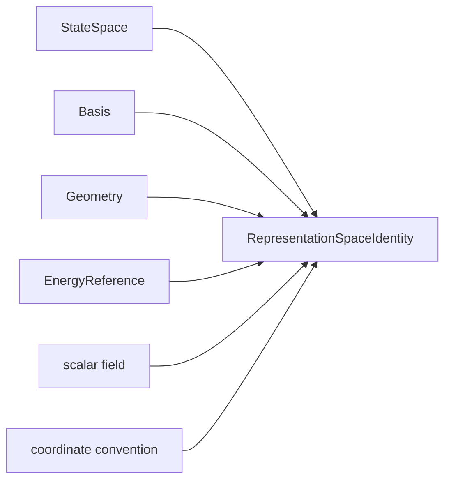

# Schematics

```mermaid
flowchart LR
    state["StateSpace"] --> space["RepresentationSpaceIdentity"]
    basis["Basis"] --> space
    geometry["Geometry"] --> space
    energy["EnergyReference"] --> space
    scalar["scalar field"] --> space
    coordinates["coordinate convention"] --> space
```
