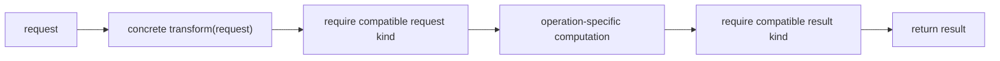
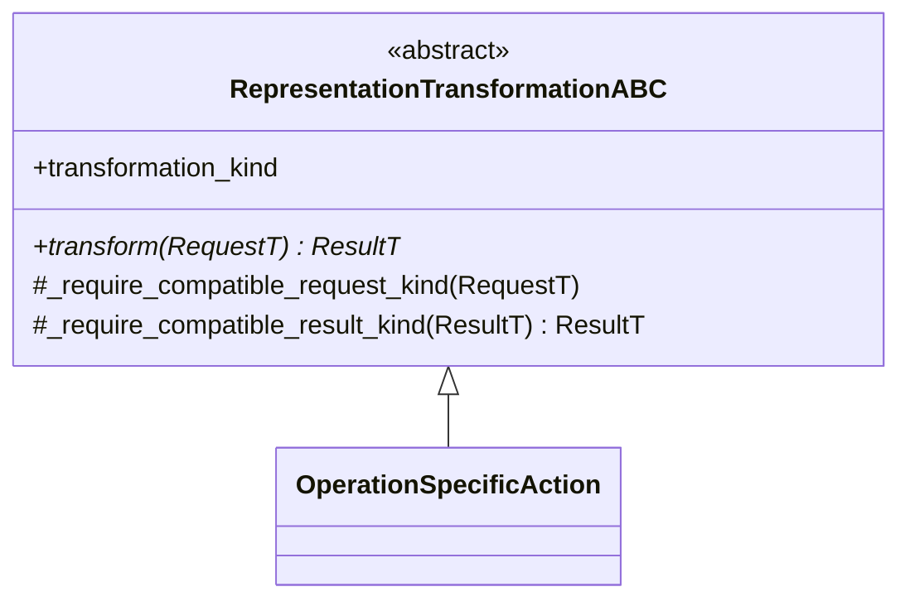

# Schematics

```mermaid
flowchart LR
    request["request"] --> public["concrete transform(request)"]
    public --> requestCheck["require compatible request kind"]
    requestCheck --> operation["operation-specific computation"]
    operation --> resultCheck["require compatible result kind"]
    resultCheck --> result["return result"]
```

```mermaid
classDiagram
    class RepresentationTransformationABC {
        <<abstract>>
        +transformation_kind
        +transform(RequestT) ResultT*
        #_require_compatible_request_kind(RequestT)
        #_require_compatible_result_kind(ResultT) ResultT
    }
    RepresentationTransformationABC <|-- OperationSpecificAction
```
