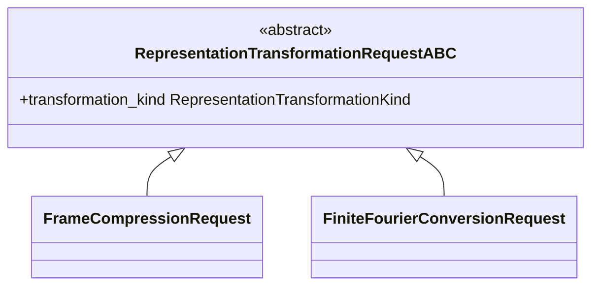
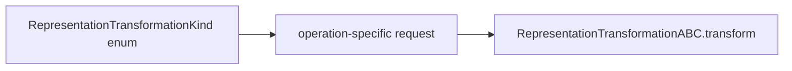

# Schematics

```mermaid
classDiagram
    class RepresentationTransformationRequestABC {
        <<abstract>>
        +transformation_kind RepresentationTransformationKind
    }
    RepresentationTransformationRequestABC <|-- FrameCompressionRequest
    RepresentationTransformationRequestABC <|-- FiniteFourierConversionRequest
```

```mermaid
flowchart LR
    member["RepresentationTransformationKind enum"] --> request["operation-specific request"]
    request --> action["RepresentationTransformationABC.transform"]
```
