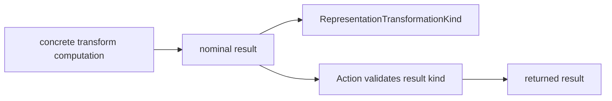

# Schematics

```mermaid
flowchart LR
    operation["concrete transform computation"] --> result["nominal result"]
    result --> kind["RepresentationTransformationKind"]
    result --> validate["Action validates result kind"]
    validate --> returned["returned result"]
```
