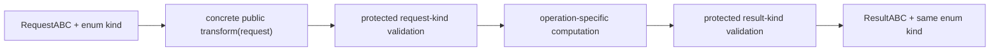
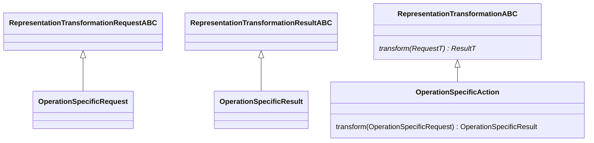

# Schematics

```mermaid
flowchart LR
    request["RequestABC + enum kind"] --> transform["concrete public transform(request)"]
    transform --> requestCheck["protected request-kind validation"]
    requestCheck --> operation["operation-specific computation"]
    operation --> resultCheck["protected result-kind validation"]
    resultCheck --> result["ResultABC + same enum kind"]
```

```mermaid
classDiagram
    RepresentationTransformationRequestABC <|-- OperationSpecificRequest
    RepresentationTransformationResultABC <|-- OperationSpecificResult
    RepresentationTransformationABC <|-- OperationSpecificAction
    RepresentationTransformationABC : transform(RequestT) ResultT*
    OperationSpecificAction : transform(OperationSpecificRequest) OperationSpecificResult
```
