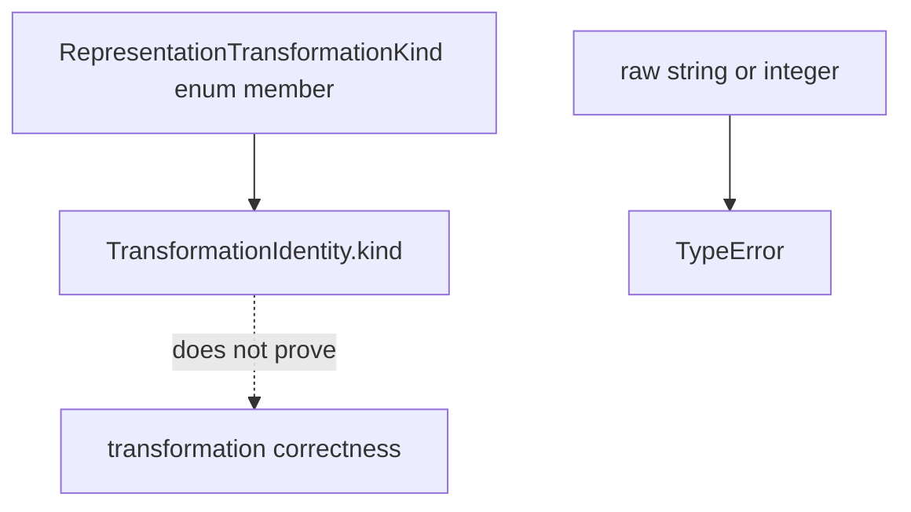

# Schematics

```mermaid
flowchart LR
    ambient["BlochSpaceRole.ambient node"] -->|"frame_compression"| retained["BlochSpaceRole.retained node"]
    retained -->|"gauge_conjugation"| retainedGauge["retained Bloch node"]
    retainedGauge -->|"alignment"| retainedAligned["retained Bloch node"]
    retainedAligned -->|"finite_fourier_conversion"| complete["complete cell-hopping node"]
    complete -->|"support_truncation"| truncated["support-truncated cell-hopping node"]
    truncated -->|"fourier_reconstruction"| reconstructed["retained Bloch node"]
```

```mermaid
flowchart TD
    member["RepresentationTransformationKind enum member"] --> edge["TransformationIdentity.kind"]
    raw["raw string or integer"] --> reject["TypeError"]
    edge -. "does not prove" .-> evidence["transformation correctness"]
```
