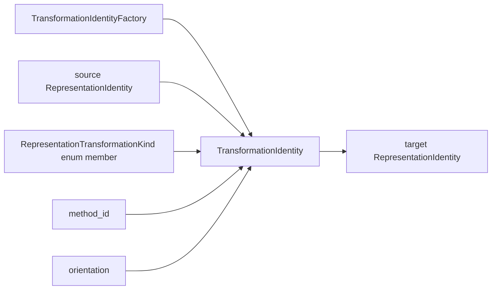
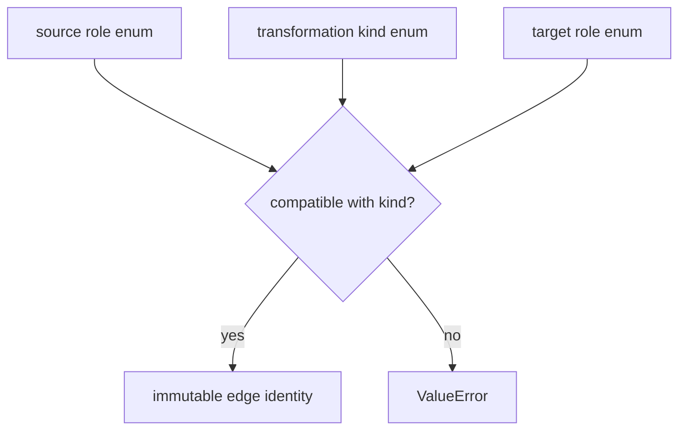

# Schematics

```mermaid
flowchart LR
    factory["TransformationIdentityFactory"] --> edge["TransformationIdentity"]
    source["source RepresentationIdentity"] --> edge
    kind["RepresentationTransformationKind enum member"] --> edge
    method["method_id"] --> edge
    orientation["orientation"] --> edge
    edge --> target["target RepresentationIdentity"]
```

```mermaid
flowchart TD
    sourceRole["source role enum"] --> compatible{"compatible with kind?"}
    kind["transformation kind enum"] --> compatible
    targetRole["target role enum"] --> compatible
    compatible -->|yes| identity["immutable edge identity"]
    compatible -->|no| reject["ValueError"]
```
