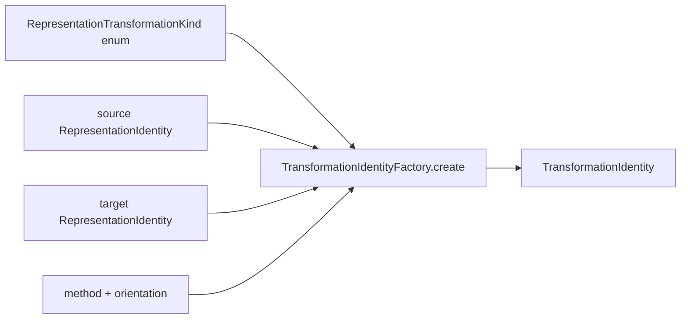
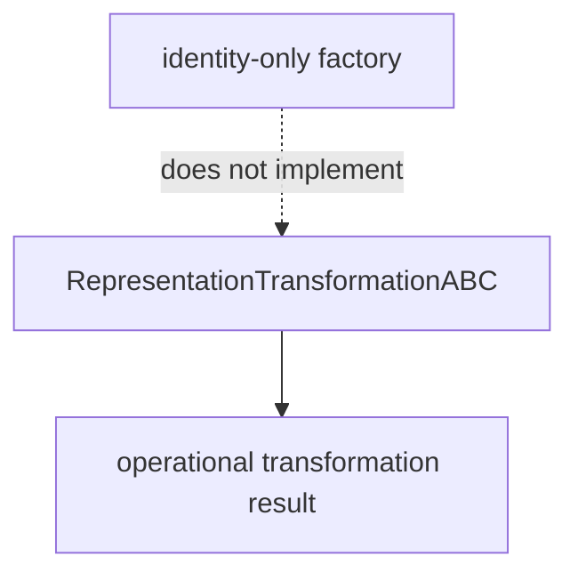

# Schematics

```mermaid
flowchart LR
    kind["RepresentationTransformationKind enum"] --> factory["TransformationIdentityFactory.create"]
    source["source RepresentationIdentity"] --> factory
    target["target RepresentationIdentity"] --> factory
    method["method + orientation"] --> factory
    factory --> edge["TransformationIdentity"]
```

```mermaid
flowchart TD
    factory["identity-only factory"] -. "does not implement" .-> action["RepresentationTransformationABC"]
    action --> result["operational transformation result"]
```
