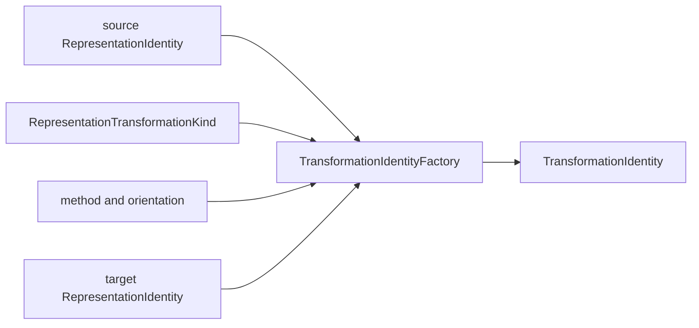
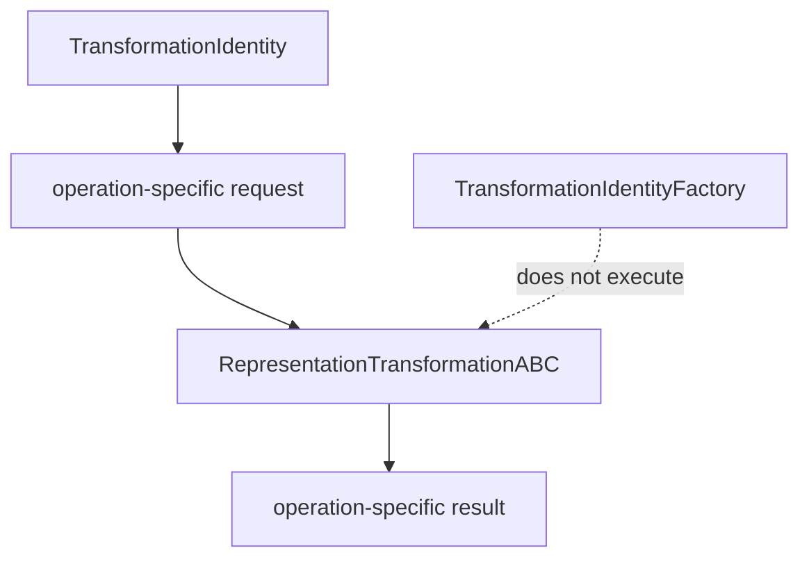

# Schematics

## Edge identity construction

```mermaid
flowchart LR
    source["source RepresentationIdentity"] --> factory["TransformationIdentityFactory"]
    kind["RepresentationTransformationKind"] --> factory
    method["method and orientation"] --> factory
    target["target RepresentationIdentity"] --> factory
    factory --> edge["TransformationIdentity"]
```

## Identity versus operation

```mermaid
flowchart TD
    edge["TransformationIdentity"] --> request["operation-specific request"]
    request --> action["RepresentationTransformationABC"]
    action --> result["operation-specific result"]
    factory["TransformationIdentityFactory"] -. "does not execute" .-> action
```
