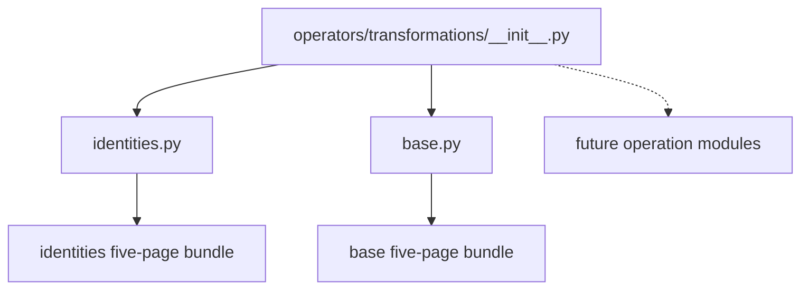
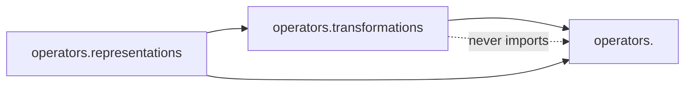
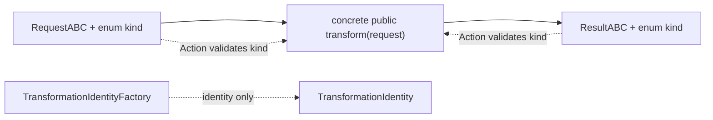
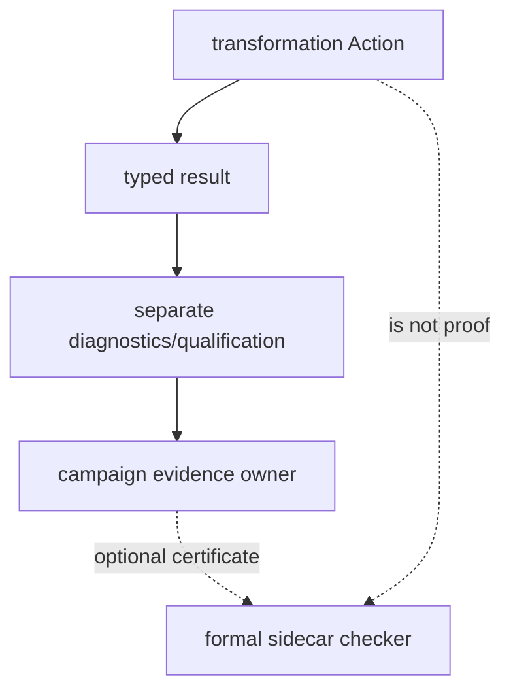

# Schematics

## Source mirror

```mermaid
flowchart TD
    package["operators/transformations/__init__.py"]
    identities["identities.py"]
    base["base.py"]
    operations["future operation modules"]

    package --> identities
    package --> base
    package -.-> operations
    identities --> identityDocs["identities five-page bundle"]
    base --> baseDocs["base five-page bundle"]
```

## Dependency and concrete-operator direction

```mermaid
flowchart LR
    representations["operators.representations"] --> transformations["operators.transformations"]
    transformations --> concrete["operators.<concrete_operator>"]
    representations --> concrete
    transformations -. "never imports" .-> concrete
```

## Nominal operational flow

```mermaid
flowchart LR
    request["RequestABC + enum kind"] --> action["concrete public transform(request)"]
    action --> result["ResultABC + enum kind"]
    request -. "Action validates kind" .-> action
    result -. "Action validates kind" .-> action
    factory["TransformationIdentityFactory"] -. "identity only" .-> edge["TransformationIdentity"]
```

## Evidence boundary

```mermaid
flowchart TD
    action["transformation Action"] --> result["typed result"]
    result --> analyzer["separate diagnostics/qualification"]
    analyzer --> evidence["campaign evidence owner"]
    evidence -. "optional certificate" .-> formal["formal sidecar checker"]
    action -. "is not proof" .-> formal
```
