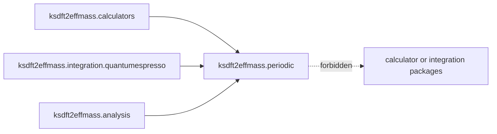

# `ksdft2effmass.periodic` package

The prospective `ksdft2effmass.periodic` package owns backend-neutral periodic
geometry and structure semantics consumed by calculators, integrations, and
analysis.

The package does not own calculator invocation, native formats, workflow
control, comparison policy, or scientific acceptance. The human-selected
[DFT simulation CPN service decision](../workflows/dft-simulation-cpn-service-decision.md)
introduces private `_bands` records for the bounded tutorial probe. Those records
are not package-root exports and do not select a stable public wire contract;
other exact internal modules remain deferred.
