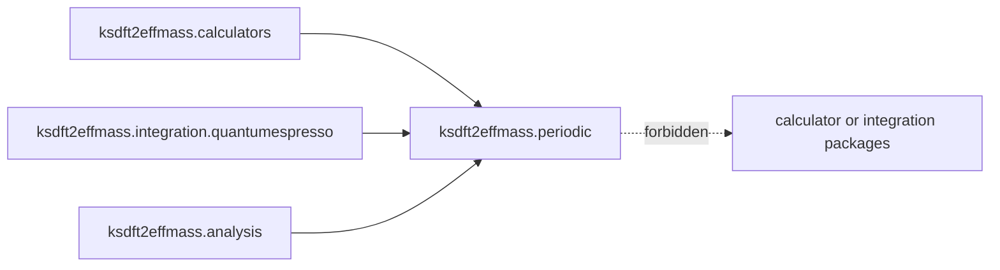

# `ksdft2effmass.periodic` package

The prospective `ksdft2effmass.periodic` package owns backend-neutral periodic
geometry and structure semantics consumed by calculators, integrations, and
analysis.

The package does not own calculator invocation, native formats, workflow
control, or scientific disposition. Architecture v2 does not yet select its
exact internal modules or public wire exports.
