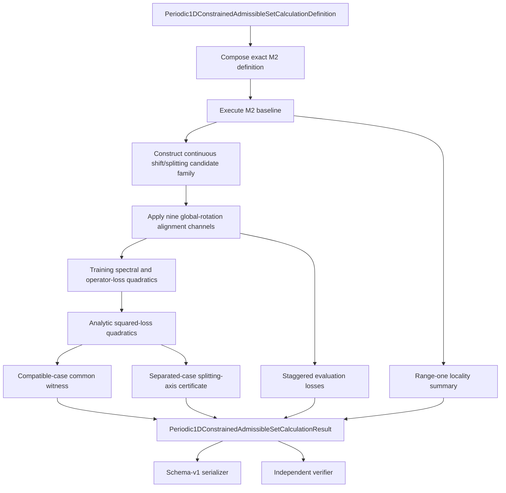
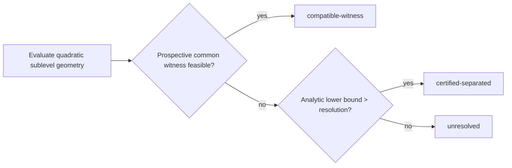

# M3 calculation schematic

## Information-flow restrictions

- M2 training data determines the reference and attacked represented operators.
- M3 training formulas determine exact quadratics over the continuous parameter
  rectangle; thresholds then determine witnesses and separation certificates.
- M3 evaluation coordinates are disjoint and diagnostic only.
- Evaluation data cannot change any threshold, quadratic, witness, certificate,
  parameter range, or disposition.
- The post-hoc sensitivity package consumes sealed M3 evidence but is not an input to
  the confirmatory package.

## Disposition logic

Failure of the prospective witness alone cannot prove separation. The result follows
the `unresolved` branch unless the independent splitting-axis lower bound closes the
gap above the frozen resolution.
