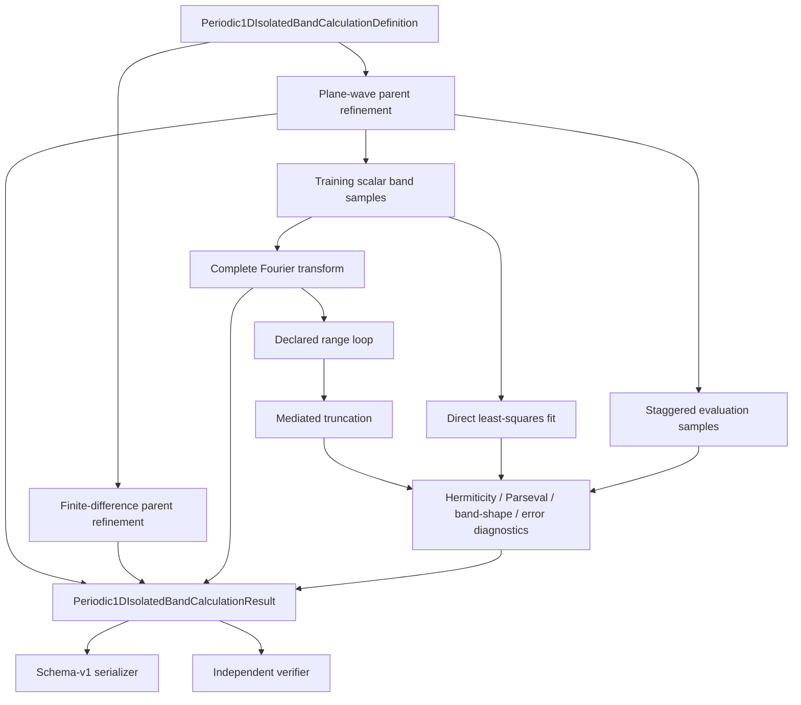

# M1 calculation schematic

## Role constraints

- Parent refinement coordinates are not the reduction training mesh.
- Training samples determine the complete transform and both finite-range routes.
- Staggered evaluation samples are diagnostic only.
- Serialization does not perform scientific calculations.
- The verifier reconstructs from the typed definition and result without invoking the
  producer Action.

## State-space transitions

| Step | Input space | Output space | Operation |
|---|---|---|---|
| Parent construction | plane-wave or coordinate-grid representation | ordered parent eigenvalues | discretization and diagonalization |
| Band selection | parent spectrum | scalar sampled band | spectral selection |
| Fourier transform | scalar reciprocal samples | complete finite periodic hopping blocks | basis transformation |
| Truncation | complete hopping representation | finite-range hopping representation | model reduction |
| Direct fit | scalar reciprocal samples | finite-range hopping representation | least-squares inference |
| Interpolation | finite-range hopping blocks | scalar reciprocal samples | represented-model evaluation |

No subtraction or comparison is performed across unidentified state spaces.
