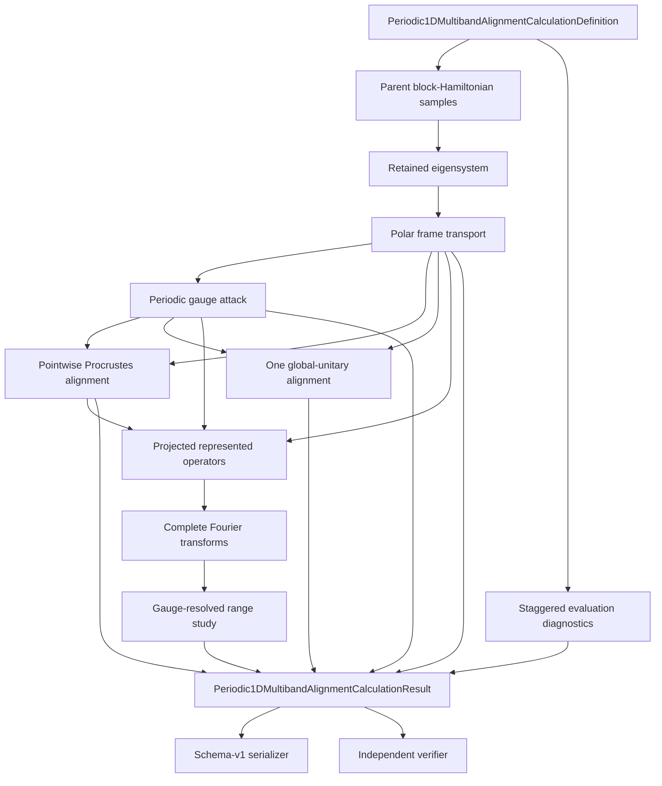

# M2 calculation schematic

## Channel identities

| Channel | Frame | Invariance status | Locality role |
|---|---|---|---|
| Reference | transported $F(k)$ | baseline | baseline hopping decay |
| Attacked | $F(k)A(k)$ | same subspace and spectrum | demonstrates gauge-sensitive blocks |
| Pointwise aligned | attacked frame with $U(k)$ | constructed recovery | tests exact pointwise recovery |
| Globally constrained | attacked frame with one $U_0$ | finite constrained family | diagnostics only; not Fourier transformed as the primary recovered channel |

Training determines all frame and hopping objects. Evaluation coordinates only test the
already frozen objects.
