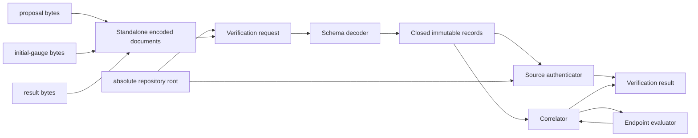

# Schematic

## Ownership and execution flow

`Periodic2DOptimizerStandaloneEncodedDocuments` owns only the three exact byte wires.
The verification request, not the encoded-document DataObject, owns the repository root.
The decoder's built-in list and dictionary containers are temporary and do not cross the
schema-adaptation boundary; authentication and correlation receive frozen typed records.

## Action responsibilities

| Owner | Responsibility | Explicitly excluded |
|---|---|---|
| `Periodic2DOptimizerStandaloneDocumentDecoder` | Select schemas and adapt verifier-owned fields | authentication, convergence judgment, acceptance |
| `OptimizerStandaloneLegacyResultDecoder` | Reject duplicate keys and confine historical positive infinity | general permissive JSON parsing |
| `Periodic2DOptimizerStandaloneSourceAuthenticator` | Bind exact compact bytes to fixed confined repository files and digests | external native-root access, recursive provenance traversal |
| `OptimizerStandaloneEndpointEvaluator` | Reconstruct spread algebra, selected endpoint, iteration total, and terminal class | native execution and optimizer replay |
| `OptimizerStandaloneSensitivityCorrelator` | Reconstruct rejected-pair sensitivity and candidate identities relative to the best representative | generic threshold strategy or causal inference |
| `Periodic2DOptimizerStandaloneCorrelator` | Correlate starts, endpoints, summaries, basin membership/order, controls, and claim boundary | generic basin framework or scientific acceptance |
| `Periodic2DOptimizerStandaloneCampaignVerifier` | Orchestrate the preceding request-scoped Actions | private replay kernel or shared mutable verifier |

## State and identity boundaries

The explicit deterministic-start order defines the endpoint `start_index` correlation.
Configuration, optimizer arm, and start identities are read from retained fields rather
than inferred from array order, filenames, paths, or numerical values. Fixed
campaign-relative paths are authentication policy owned by the authenticator; historical
absolute path strings are preserved report content only.

No arrow in the schematic reaches the external native run roots retained in the result.
The portable route therefore cannot establish native-file presence or historical
execution provenance.
