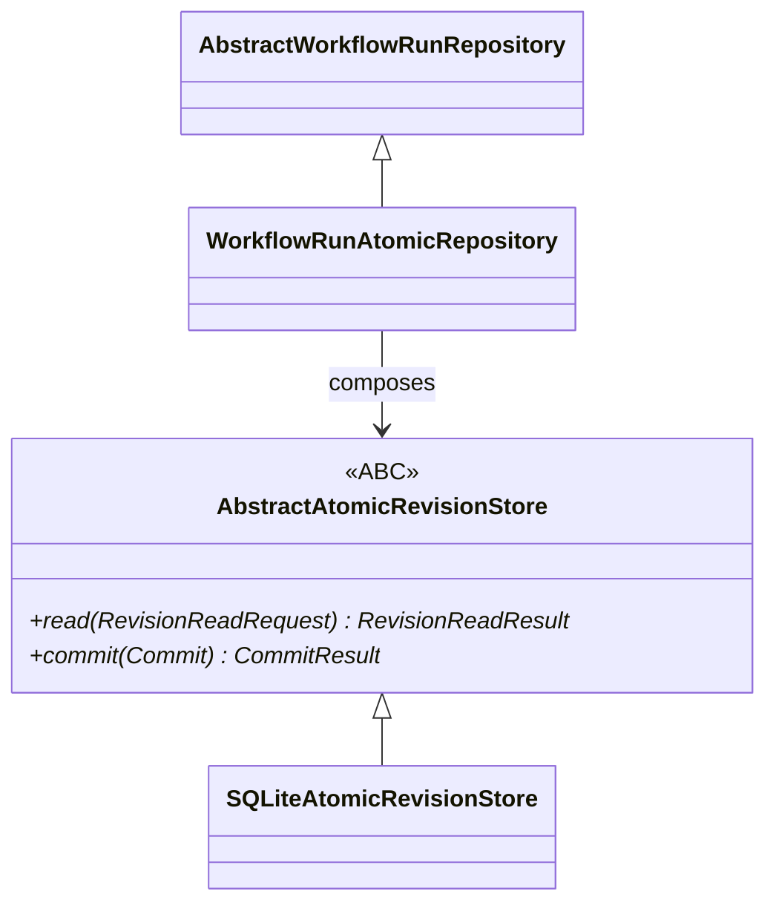

# `AbstractAtomicRevisionStore` schematic

```mermaid
classDiagram
    class AbstractAtomicRevisionStore {
        <<ABC>>
        +read(RevisionReadRequest) RevisionReadResult*
        +commit(Commit) CommitResult*
    }
    class SQLiteAtomicRevisionStore
    class AbstractWorkflowRunRepository
    class WorkflowRunAtomicRepository

    AbstractAtomicRevisionStore <|-- SQLiteAtomicRevisionStore
    AbstractWorkflowRunRepository <|-- WorkflowRunAtomicRepository
    WorkflowRunAtomicRepository --> AbstractAtomicRevisionStore : composes
```
