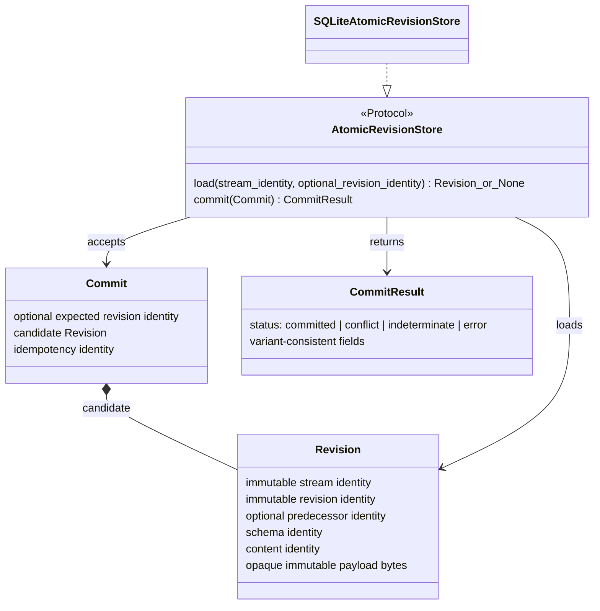
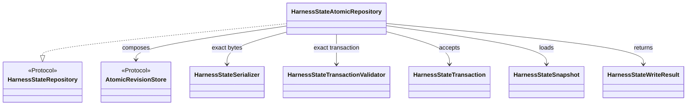
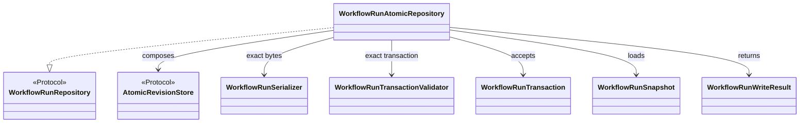
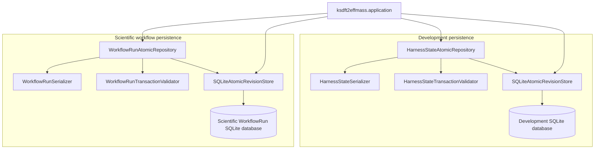
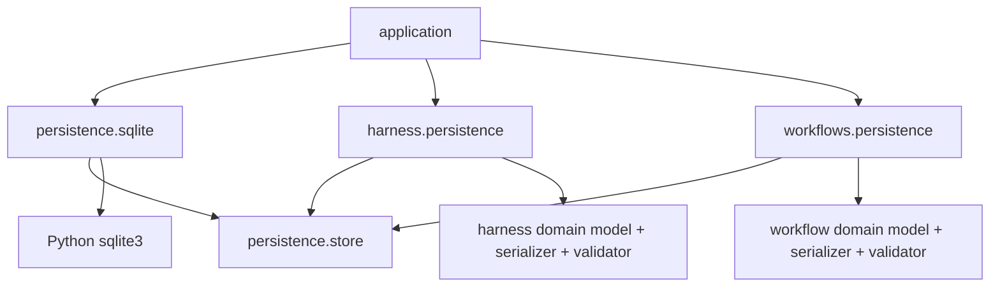

# `ksdft2effmass.persistence` package

## Status and scope

This page defines the prospective Architecture v2 persistence boundary selected for `ksdft2effmass.persistence`. It is documentation only: the package and modules do not yet exist, no source creation or implementation is authorized here, and no software, numerical, or scientific validation is claimed.

The selected architecture is a lean shared revision-storage capability with domain-owned repositories. It is not a generic domain repository, generic CRUD layer, or database inheritance hierarchy.

## Minimal module tree

```text
ksdft2effmass/
├── persistence/
│   ├── __init__.py          # supported shared persistence exports
│   ├── store.py             # revision values and AtomicRevisionStore protocol
│   └── sqlite.py            # SQLiteAtomicRevisionStore
├── harness/
│   └── persistence.py       # HarnessState persistence contract and adapter
├── workflows/
│   └── persistence.py       # WorkflowRun persistence contract and adapter
└── application/             # explicit construction and configuration
```

The exact prospective modules are `persistence/__init__.py`, `persistence/store.py`, `persistence/sqlite.py`, `harness/persistence.py`, and `workflows/persistence.py`. These are prospective source paths, not authorization to create them. No domain persistence subpackages or additional module split is selected at this starting point.

## Ownership

| Owner | Prospective public objects and responsibility |
|---|---|
| `persistence.store` | Immutable `Revision`, `Commit`, and `CommitResult`; structural `AtomicRevisionStore` protocol |
| `persistence.sqlite` | Concrete `SQLiteAtomicRevisionStore` using Python standard-library `sqlite3` |
| `harness.persistence` | Existing harness transaction, snapshot, write-result, serializer, validator, and repository protocol; concrete `HarnessStateAtomicRepository` |
| `workflows.persistence` | Existing workflow transaction, snapshot, write-result, serializer, validator, and repository protocol; concrete `WorkflowRunAtomicRepository` |
| `application` | Explicit database locations and store/repository construction; default separation of development and scientific databases |

`persistence.store` sees stream and revision identities plus opaque immutable payload bytes. It does not know `HarnessState`, `WorkflowRun`, colored Petri nets, scientific meaning, or development authority.

## Shared store contract



`AtomicRevisionStore` is structural. `load(stream identity, optional revision identity)` returns the consistently selected `Revision` or `None`; `commit(Commit)` returns one immutable `CommitResult`. The result is a single DataObject/ResultObject with the strict closed discriminant `committed`, `conflict`, `indeterminate`, or `error`. Its fields must be consistent with its variant. In particular, an indeterminate acknowledgement remains representable and is never guessed to be a commit or conflict.

The shared store owns:

- compare-and-swap enforcement of the expected revision;
- idempotency for the supplied idempotency identity;
- durable stream, revision, predecessor, schema, and content-identity closure;
- atomic commit of one complete revision to one stream;
- consistent reads; and
- the generic commit outcome.

A commit contains one complete opaque aggregate revision. The store supplies neither cross-stream atomicity nor normalized-domain-row semantics.

`SQLiteAtomicRevisionStore` implements this protocol with `sqlite3`. Its constructor receives explicit configuration; it performs no ambient path, credential, database, or current-revision discovery. Schema initialization remains private. This selection introduces no third-party dependency and does not define a public initializer, configuration object, or migrator hierarchy.

## Domain repository composition





The domain protocols and their existing transaction, snapshot, write-result, serializer, and transaction-validator contracts remain domain-owned. `HarnessStateAtomicRepository` and `WorkflowRunAtomicRepository` are concrete repository ActionObjects composed with an `AtomicRevisionStore`, their exact domain serializer, and their exact transaction validator. There is no domain-specific SQLite subclass.

A domain repository is not a passive DAO. It:

1. invokes its exact validator for the submitted domain transaction;
2. invokes its exact serializer for that transaction's complete candidate aggregate;
3. binds validation, serialized bytes, aggregate identity, stream identity, expected revision, schema identity, content identity, and idempotency identity;
4. rejects detached validation or serialization evidence that names different candidate state or bytes;
5. submits the bound `Commit` to the shared store; and
6. maps the generic commit outcome to the domain write-result contract without weakening the domain's aggregate-specific closure.

This prevents a passing validation result from being reused for different bytes or a different candidate. Development owns `HarnessState` meaning and validator rules. Scientific workflow owns `WorkflowRun` meaning and validator rules. The shared store owns neither.

Every successor record and obligation in one `WorkflowRunTransaction` is serialized into its one complete aggregate revision. The storage transaction does not spread that unit across normalized domain rows or multiple streams.

## Runtime composition



Separate `SQLiteAtomicRevisionStore` instances and separate databases are the default. A shared implementation does not imply a shared physical database. Co-location or cross-stream transaction support requires a later explicit decision.

## Dependency direction



The shared persistence package has only standard-library upstream dependencies. `persistence.sqlite` depends on `persistence.store` and `sqlite3`. Domain persistence modules depend on `persistence.store` plus their own model, serializer, and validator contracts. `application` is downstream and composes the concrete objects.

`persistence` must not import `harness`, `workflows`, `petrinet`, `calculators`, `analysis`, `provenance`, or `application`. Domain models must not import repository implementations. The design introduces no `Persistence → DatabasePersistence → SQLitePersistence` inheritance, common generic domain `Repository` base, or generic CRUD model.

## Transaction and failure boundary

One shared-store commit is atomic for one stream and one complete opaque candidate revision. Compare-and-swap conflict is distinct from an operational error. An acknowledgement whose durable outcome cannot be established is `indeterminate`; callers reconcile through explicit identity-bound reads under the eventual exact failure contract and never infer success from absence of an error.

External process execution, artifact transfer, projection publication, protected authority-ledger updates, and scientific publication effects are outside this transaction. Stable identities and domain obligations bridge those boundaries. An ordinary `SQLiteAtomicRevisionStore` does not silently become trusted persistence for `DevelopmentAuthorityLedger`, immutable projection generations and pointer publication, external artifacts, or scientific publication effects.

## Explicit exclusions

The initial architecture includes no:

- migration classes or integrity-verifier classes;
- public SQLite configuration class, initializer, or schema migrator;
- generic read-result class, `RevisionAddress`, catalog, registry, or configuration hierarchy;
- generic domain repository base or generic CRUD API;
- domain SQLite subclass;
- domain persistence subpackage or extra module split;
- cross-stream atomicity or normalized-domain-row model; or
- `WorkflowRunIntegrityVerifier`.

Replay-computation ownership remains unresolved. This persistence selection does not authorize a repository to fire transitions and does not resolve replay. The colored-Petri-net selection-identity retention gap also remains unresolved.

## Deferred issues

- Exact bytes and wire schemas, including whether canonical bytes are required.
- Exact SQLite schema and physical layout.
- Connection lifetime and ownership.
- Locking, isolation, busy handling, and writer coordination.
- Exact public exception and failure encodings, including reconciliation after `indeterminate`.
- Backup, recovery, retention, and compaction policy.
- Maximum complete-aggregate size and resulting performance limits.
- Co-location, shared physical databases, and any cross-stream transaction semantics.
- Replay-computation ownership and colored-Petri-net selection-identity retention.

These deferred choices must preserve the selected ownership and failure boundaries or receive a later explicit architectural decision. Demonstrated need and applicable authority are required before adding excluded abstractions.
