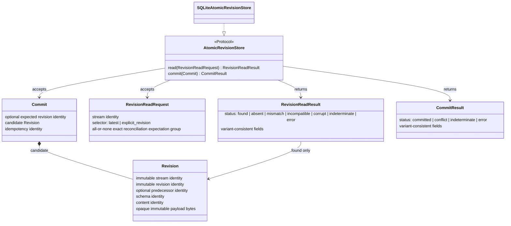
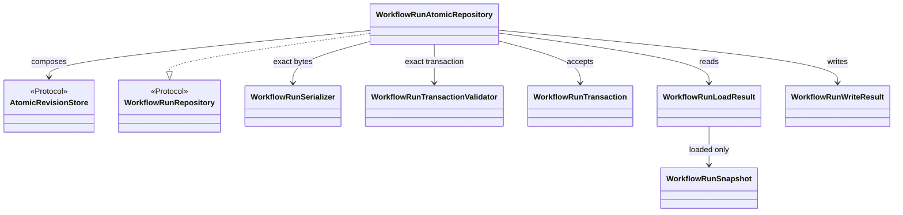
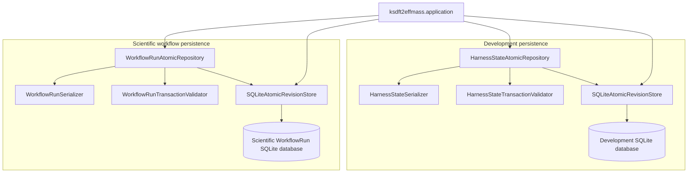
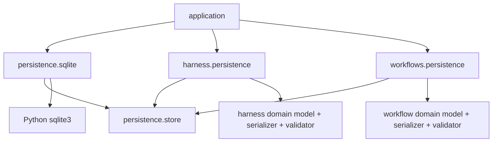

# `ksdft2effmass.persistence` package

## Status and scope

This page defines the prospective Architecture v2 persistence boundary selected for `ksdft2effmass.persistence`. It is documentation only: the package and modules do not yet exist, no source creation or implementation is authorized here, and no software, numerical, or scientific validation is claimed.

The selected architecture is a lean shared revision-storage capability with domain-owned repositories. It is not a generic domain repository, generic CRUD layer, or database inheritance hierarchy.

## Minimal module tree

```text
ksdft2effmass/
├── persistence/
│   ├── __init__.py          # supported shared persistence exports
│   ├── store.py             # revision values and AtomicRevisionStore protocol
│   └── sqlite.py            # SQLiteAtomicRevisionStore
├── harness/
│   └── persistence.py       # HarnessState persistence contract and adapter
├── workflows/
│   └── persistence.py       # WorkflowRun persistence contract and adapter
└── application/             # explicit construction and configuration
```

The exact prospective modules are `persistence/__init__.py`, `persistence/store.py`, `persistence/sqlite.py`, `harness/persistence.py`, and `workflows/persistence.py`. These are prospective source paths, not authorization to create them. No domain persistence subpackages or additional module split is selected at this starting point.

## Ownership

| Owner | Prospective public objects and responsibility |
|---|---|
| `persistence.store` | Immutable `Revision`, `RevisionReadRequest`, `RevisionReadResult`, `Commit`, and `CommitResult`; structural `AtomicRevisionStore` protocol |
| `persistence.sqlite` | Concrete `SQLiteAtomicRevisionStore` using Python standard-library `sqlite3` |
| `harness.persistence` | Harness transaction, snapshot, closed load/write results, serializer, validator, and repository protocol; concrete `HarnessStateAtomicRepository` |
| `workflows.persistence` | Workflow transaction, snapshot, closed load/write results, serializer, validator, and repository protocol; concrete `WorkflowRunAtomicRepository` |
| `application` | Explicit database locations and store/repository construction; default separation of development and scientific databases |

`persistence.store` sees stream and revision identities plus opaque immutable payload bytes. It does not know `HarnessState`, `WorkflowRun`, colored Petri nets, scientific meaning, or development authority.

## Shared store contract



`AtomicRevisionStore` is structural. `read(RevisionReadRequest)` returns one immutable `RevisionReadResult`; `commit(Commit)` returns one immutable `CommitResult`. `RevisionReadRequest` contains request and stream identities plus exactly one selector discriminant. The valid combinations are:

| Selector | Required | Optional | Prohibited |
|---|---|---|---|
| `latest` | Request identity, stream identity, `latest` discriminant | None | Explicit revision identity and every reconciliation-expectation field |
| `explicit_revision` | Request identity, stream identity, `explicit_revision` discriminant, exact revision identity | Either no reconciliation expectations, or one complete expectation group | Partial expectation groups |

A complete reconciliation-expectation group contains the exact predecessor slot, including explicit no-predecessor where applicable, schema identity, content identity, and idempotency identity. These fields are all present or all absent. The request performs no ambient stream or latest-version discovery beyond its explicit selector.

Every `RevisionReadResult` contains result identity, request identity, stream identity, selector, store implementation/version identity, status, ordered sanitized diagnostics, and claim boundary. Its variant fields are closed:

| Status | Required variant fields | Prohibited variant fields |
|---|---|---|
| `found` | One complete `Revision`; exact expectation-match confirmation when expectations were supplied | Mismatch identities and failure payload |
| `absent` | Exact requested address and established-absence observation | Revision, mismatch identities, and failure payload |
| `mismatch` | Complete expected generic identity set, observed conflicting identity set, and ordered mismatched-field identities | Revision payload and domain snapshot |
| `incompatible` | Observed unsupported store/envelope version identities and compatibility finding | Revision payload and presence/absence claim |
| `corrupt` | Observed generic revision/content identities where readable and ordered integrity findings | Revision payload and domain snapshot |
| `indeterminate` | Failed observation phase and diagnostic explaining why presence or integrity is unknown | Revision and presence/absence claim |
| `error` | Failed operation phase and structured operational failure | Revision and presence/absence claim |

`RevisionReadResult` has the strict closed discriminant `found`, `absent`, `mismatch`, `incompatible`, `corrupt`, `indeterminate`, or `error`. Only `found` contains one `Revision` satisfying every supplied reconciliation expectation; `absent` establishes that the explicitly requested observation is not present in the store's consistent read; `mismatch` reports a well-formed stored observation at the requested address whose predecessor, schema, content, or idempotency identities differ from the supplied expectations and contains only the observed conflicting identities needed for diagnosis, not a domain snapshot; `incompatible` reports an unsupported shared-store or revision-envelope version; `corrupt` reports failed generic revision/content integrity; `indeterminate` reports that presence or integrity could not be established; and `error` reports an operational failure that does not imply presence or absence. No non-`found` variant fabricates a revision.

`CommitResult` has the strict closed discriminant `committed`, `conflict`, `indeterminate`, or `error`. Its fields must be consistent with its variant. In particular, an indeterminate acknowledgement remains representable and is never guessed to be a commit or conflict.

The shared store owns:

- compare-and-swap enforcement of the expected revision;
- idempotency for the supplied idempotency identity: an exact replay of the same bound `Commit` returns the original committed revision without creating another revision, while reuse of that identity with any different bound commit field or bytes returns an idempotency-collision `conflict`;
- durable stream, revision, predecessor, schema, and content-identity closure;
- atomic commit of one complete revision to one stream;
- closed consistent revision reads and exact identity-bound reconciliation observations; and
- generic read and commit outcomes.

A commit contains one complete opaque aggregate revision. The store supplies neither cross-stream atomicity nor normalized-domain-row semantics.

`SQLiteAtomicRevisionStore` implements this protocol with `sqlite3`. Its constructor receives explicit configuration; it performs no ambient path, credential, database, or current-revision discovery. Schema initialization remains private. This selection introduces no third-party dependency and does not define a public initializer, configuration object, or migrator hierarchy.

## Domain repository composition




The domain protocols and their existing transaction, snapshot, write-result, serializer, and transaction-validator contracts remain domain-owned. `HarnessStateAtomicRepository` and `WorkflowRunAtomicRepository` are concrete repository ActionObjects composed with an `AtomicRevisionStore`, their exact domain serializer, and their exact transaction validator. There is no domain-specific SQLite subclass.

A domain repository is not a passive DAO. On write it:

1. invokes its exact validator for the submitted domain transaction;
2. invokes its exact serializer for that transaction's complete candidate aggregate;
3. binds validation, serialized bytes, aggregate identity, stream identity, expected revision, schema identity, content identity, and idempotency identity;
4. rejects detached validation or serialization evidence that names different candidate state or bytes;
5. submits the bound `Commit` to the shared store; and
6. maps the generic commit outcome to the domain write-result contract without weakening the domain's aggregate-specific closure.

On read it submits one explicit `RevisionReadRequest`, maps every generic read variant without guessing, verifies the found revision's stream/revision/predecessor/schema/content and requested reconciliation identities, invokes its exact serializer's deserialization boundary, invokes domain validation on the reconstructed aggregate, and returns one closed domain load result. Every domain load result contains result/request/stream/selector identities, the nested `RevisionReadResult` identity, domain repository/serializer/validator version identities, status, ordered sanitized diagnostics, and claim boundary. The variants follow this common closure:

| Domain status | Required variant fields | Prohibited variant fields |
|---|---|---|
| `loaded` | Nested `found` read result, one reconstructed domain snapshot, deserialization identity, passing domain-validation identity | Failure payload and non-loaded status evidence |
| `absent` | Nested `absent` read result | Snapshot, deserialization identity, and domain-validation identity |
| `mismatch` | Nested `mismatch` read result and conflicting generic identities | Snapshot and domain-validation identity |
| `incompatible` | Nested `incompatible` result or found revision plus unsupported domain schema/version finding | Snapshot and passing domain-validation identity |
| `corrupt` | Nested `corrupt` result or found revision plus content/deserialization/domain-integrity findings | Snapshot and passing domain-validation identity |
| `indeterminate` | Nested `indeterminate` result or domain phase whose outcome cannot be established | Snapshot and presence/absence claim |
| `error` | Nested `error` result or failed domain operation phase and structured failure | Snapshot and presence/absence claim |

Only the domain `loaded` variant contains a snapshot. Domain schema incompatibility, deserialization failure, reconstructed-content mismatch, and domain-validation failure remain domain outcomes rather than shared-store policy.

This prevents a passing validation result from being reused for different bytes or a different candidate. Development owns `HarnessState` meaning and validator rules. Scientific workflow owns `WorkflowRun` meaning and validator rules. The shared store owns neither.

Every successor record and obligation in one `WorkflowRunTransaction` is serialized into its one complete aggregate revision. The storage transaction does not spread that unit across normalized domain rows or multiple streams.

## Runtime composition



Separate `SQLiteAtomicRevisionStore` instances and separate databases are the default. A shared implementation does not imply a shared physical database. Co-location or cross-stream transaction support requires a later explicit decision.

## Dependency direction



The shared persistence package has only standard-library upstream dependencies. `persistence.sqlite` depends on `persistence.store` and `sqlite3`. Domain persistence modules depend on `persistence.store` plus their own model, serializer, and validator contracts. `application` is downstream and composes the concrete objects.

`persistence` must not import `harness`, `workflows`, `petrinet`, `calculators`, `analysis`, `provenance`, or `application`. Domain models must not import repository implementations. The design introduces no `Persistence → DatabasePersistence → SQLitePersistence` inheritance, common generic domain `Repository` base, or generic CRUD model.

## Transaction and failure boundary

One shared-store commit is atomic for one stream and one complete opaque candidate revision. Compare-and-swap conflict is distinct from an operational error. An acknowledgement whose durable outcome cannot be established is `indeterminate`; callers reconcile through an explicit `RevisionReadRequest` binding the candidate stream, revision, predecessor, schema, content, and idempotency identities and never infer success from absence of an error. A matching `found` establishes the committed revision. `absent` under the selected local SQLite consistent-read contract establishes that exact revision/idempotency observation is not committed, after which resubmitting the byte-identical `Commit` is safe under idempotency. `mismatch` establishes an identity collision rather than the requested commit. `mismatch`, `incompatible`, `corrupt`, `indeterminate`, or `error` never authorizes a retry with changed identities or bytes.

External process execution, artifact transfer, projection publication, protected authority-ledger updates, and scientific publication effects are outside this transaction. Stable identities and domain obligations bridge those boundaries. An ordinary `SQLiteAtomicRevisionStore` does not silently become trusted persistence for `DevelopmentAuthorityLedger`, immutable projection generations and pointer publication, external artifacts, or scientific publication effects.

## Explicit exclusions

The initial architecture includes no:

- migration classes or integrity-verifier classes;
- public SQLite configuration class, initializer, or schema migrator;
- `RevisionAddress`, catalog, registry, or configuration hierarchy;
- generic domain repository base or generic CRUD API;
- domain SQLite subclass;
- domain persistence subpackage or extra module split;
- cross-stream atomicity or normalized-domain-row model; or
- `WorkflowRunIntegrityVerifier`.

Workflow-owned `WorkflowRunReplayer`, not shared persistence or a domain repository, owns deterministic replay. It consumes the identity-closed colored-Petri-net evidence from one exact WorkflowRun revision and an explicit immutable runtime bundle. The workflow service gates advancement and proposed successor submission on its exact `equal` result. Shared persistence stores opaque bytes and neither resolves runtime versions nor invokes replay.

## Deferred issues

- Exact bytes and wire schemas, including whether canonical bytes are required.
- Exact SQLite schema and physical layout.
- Connection lifetime and ownership.
- Locking, isolation, busy handling, and writer coordination.
- Exact public read/write failure codes and wire encodings; the closed variants and reconciliation semantics are selected.
- Backup, recovery, retention, and compaction policy.
- Maximum complete-aggregate size and resulting performance limits.
- Co-location, shared physical databases, and any cross-stream transaction semantics.
- Exact domain replay-result wire representation remains owned by workflows, not shared persistence.

These deferred choices must preserve the selected ownership and failure boundaries or receive a later explicit architectural decision. Demonstrated need and applicable authority are required before adding excluded abstractions.
