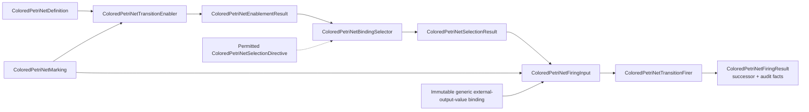

# `ksdft2effmass.petrinet.colored` package

## Status and package

This page defines the Architecture v2 generic colored-Petri-net boundary. Its canonical package is `ksdft2effmass.petrinet.colored`. The value/token, marking/binding, expression/guard, definition, structural-validation, enablement, selection, and pure-firing slices are implemented.

The public vocabulary uses the full names `ColoredPetriNetDefinition`, `ColoredPetriNetMarking`, `ColoredPetriNetToken`, `ColoredPetriNetBinding`, `ColoredPetriNetEnablementResult`, `ColoredPetriNetSelectionDirective`, `ColoredPetriNetSelectionResult`, `ColoredPetriNetFiringInput`, `ColoredPetriNetFiringResult`, `ColoredPetriNetTransitionEnabler`, `ColoredPetriNetBindingSelector`, and `ColoredPetriNetTransitionFirer`, together with precisely named immutable result and value records. Abbreviated names are not a second public API.

## Semantic model

`ColoredPetriNetDefinition` represents identified colors, places, transitions, arcs and inscriptions, pure guards, and a definition-owned total transition priority. Each color declares admitted `ColoredPetriNetValueKind` members, and each transition separately declares exact input-variable and external-output-variable order. The collections are disjoint; guards may use input variables only, while output templates may use either. Arc direction is the closed input/output inscription variant. Definitions do not embed initial markings or Workflow payload-type identities. `ColoredPetriNetToken` contains a color-qualified immutable value and an optional nominal identity. Under the accepted marking-owned multiplicity decision, the token has no multiplicity field: `ColoredPetriNetMarking` is the exclusive owner of semantic token multiplicity by place, and incidental representation order never selects behavior. Individually correlated tokens retain distinct identities rather than being collapsed into a count.

`ColoredPetriNetBinding` is an immutable ordered sequence of variable/value pairs under the definition's declared variable order. `ColoredPetriNetTransitionEnabler` evaluates inscriptions and pure guards and returns `ColoredPetriNetEnablementResult`: the complete canonically ordered enabled transition/binding set with the exact result, definition, marking, expression, and ordering-policy identities. The enabler produces the result identity as a domain-separated SHA-256 digest of the exact definition and marking identities, complete success binding set or failure state, and library-owned expression, enabler, and ordering-policy identities. This identity preimage contract is independent of the deferred public result wire format. The closed failure variant has a nominal identity bound to the result identity and contains no enabled bindings.

`ColoredPetriNetExpressionEvaluator` is the public stateless ActionObject for the closed literal/bound-variable language and pure Boolean/comparison guards. It grants no firing or Task authority and accepts no domain-policy subclass extension. `ColoredPetriNetBindingSelector` receives one exact `ColoredPetriNetEnablementResult` and an optional content-identified `ColoredPetriNetSelectionDirective`. Without a directive it selects the first complete enabled binding, whose existing canonical order applies definition-owned total priority and declared binding/value order. A directive may override that canonical choice only when the exact definition's closed selection policy is `DIRECTED_ALLOWED`; ambient choice is forbidden. The selector returns one content-identified immutable `ColoredPetriNetSelectionResult` with exactly `selected`, `empty`, `no_match`, or `failure`, binding the enablement-result identity, selected binding where applicable, selector and ordering-policy identities, and the complete directive or explicit absence. The retained directive permits firing to verify its exact enablement identity, requested binding, and content identity independently. It gives no fairness guarantee.

`ColoredPetriNetFiringInput` is immutable and contains the complete exact definition, transition identity, predecessor `ColoredPetriNetMarking`, selected `ColoredPetriNetBinding`, full enablement and selection results, the applicable directive identity or explicit absence, and an immutable generic external-output-value binding. The external binding is empty when the transition needs no values produced outside the generic net. Its keys and values are generic expression variables and color-qualified values, never Workflow, Task, calculator, or ResultObject concepts.

`ColoredPetriNetTransitionFirer` validates that the firing input's definition, predecessor marking, transition, binding, enablement result, selection result, and optional directive form one identity-closed derivation. It rejects stale or mismatched enablement, a selection not produced from that enablement, a directive not permitted by the exact definition, or a transition/binding unequal to the selection result. It evaluates input, read, and inhibitor inscriptions against the selected binding, then evaluates output inscriptions against that binding extended only by the explicit external-output-value binding. Missing, extra, or ambiguous external output values are rejected. The firer validates every produced token's place, color/type, identity where required, represented multiplicity, and arc/inscription constraints.

Successful firing consumes only input-arc tokens, preserves tokens observed through read arcs, applies inhibitor arcs only as enabling constraints, and adds exactly the validated output tokens. It returns immutable `ColoredPetriNetFiringResult` containing the successor marking plus exact definition/transition, predecessor, enablement-result, selection-result, optional-directive, selected-binding, external-output-binding, consumed-token, read-token, inhibitor-evaluation, produced-token, inscription/version, and ordering-policy audit facts. Failure contains structured findings and no successor. Firing is pure; the same exact input and versioned evaluators produce the same represented result.

## Canonical ordering and identity

Private occurrence coordinates derive from canonical place/token order and equal-token occurrence ordinal. Consume demands at a place reserve distinct consume occurrences; read demands reserve distinct read occurrences; one occurrence may satisfy both a read and a consume because observation does not remove it. Inhibitors bind no value and require matching-token absence. Occurrence-distinct choices that project to equal public value bindings are deduplicated.

Successful bindings are ordered by definition-owned transition priority and then by assignments in declared variable order using the tagged in-memory value key. Equivalent semantic markings under the same definition and ordering policy therefore produce the same ordered enablement set and selection. Exact wire formats and canonical lexical forms remain deferred.

## Prohibited domain coupling

This generic package owns only colors, places, transitions, arcs and inscriptions, pure guards, token values, markings, canonical enablement and binding selection, explicit generic firing inputs, output-inscription evaluation, produced-token validation, and pure firing. It contains no workflow or scientific concepts, external-effect behavior, authority policy, persistence policy, dispatch, or publication behavior. A generic firing never invokes domain operations or creates domain records.

`ksdft2effmass.workflows` imports `ksdft2effmass.petrinet.colored`. The reverse dependency is forbidden. Workflow code may use abbreviated private or local import aliases, but prospective documentation and public exports use only the full `ColoredPetriNet*` terminology.

## Deferred implementation details

- Canonical definition, marking, expression, token-value, and result wire formats.
- Canonical identity lexical forms.
- Runtime-bundle wire binding for the implemented in-memory expression-evaluator
  and enablement-ordering identities.
