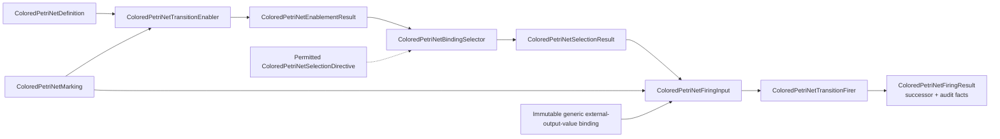

# `ksdft2effmass.petrinet.colored` package

## Status and package

This page defines the prospective Architecture v2 generic colored-Petri-net boundary. It is not implemented. Its canonical package is `ksdft2effmass.petrinet.colored`.

The public vocabulary uses the full names `ColoredPetriNetDefinition`, `ColoredPetriNetMarking`, `ColoredPetriNetToken`, `ColoredPetriNetBinding`, `ColoredPetriNetEnablementResult`, `ColoredPetriNetSelectionDirective`, `ColoredPetriNetSelectionResult`, `ColoredPetriNetFiringInput`, `ColoredPetriNetFiringResult`, `ColoredPetriNetTransitionEnabler`, `ColoredPetriNetBindingSelector`, and `ColoredPetriNetTransitionFirer`, together with precisely named immutable result and value records. Abbreviated names are not a second public API.

## Semantic model

`ColoredPetriNetDefinition` represents identified colors, places, transitions, arcs and inscriptions, pure guards, and a definition-owned total transition priority. `ColoredPetriNetToken` contains a color-qualified immutable value and, where required, an identity or represented multiplicity. `ColoredPetriNetMarking` is a semantic multiset of tokens by place; incidental representation order never selects behavior.

`ColoredPetriNetBinding` is an immutable ordered sequence of variable/value pairs under the definition's declared variable order. `ColoredPetriNetTransitionEnabler` evaluates inscriptions and pure guards and returns `ColoredPetriNetEnablementResult`: the complete canonically ordered enabled transition/binding set with the exact definition, marking, expression, and ordering-policy identities.

`ColoredPetriNetBindingSelector` receives one exact `ColoredPetriNetEnablementResult` and an optional identified `ColoredPetriNetSelectionDirective`. Without a directive it applies definition-owned total priority, then canonical transition identity, then canonical binding order. A directive may override that canonical choice only when the exact versioned definition explicitly permits it; ambient choice is forbidden. The selector returns one immutable `ColoredPetriNetSelectionResult` binding the enablement-result identity, selected transition and binding, selector and ordering-policy versions, and the applicable directive identity or explicit absence. It gives no fairness guarantee.

`ColoredPetriNetFiringInput` is immutable and contains the exact definition and transition identities, predecessor `ColoredPetriNetMarking`, selected `ColoredPetriNetBinding`, exact enablement-result and selection-result identities, the applicable directive identity or explicit absence, and an immutable generic external-output-value binding. The external binding is empty when the transition needs no values produced outside the generic net. Its keys and values are generic expression variables and color-qualified values, never Workflow, Task, calculator, or ResultObject concepts.

`ColoredPetriNetTransitionFirer` validates that the firing input's definition, predecessor marking, transition, binding, enablement result, selection result, and optional directive form one identity-closed derivation. It rejects stale or mismatched enablement, a selection not produced from that enablement, a directive not permitted by the exact definition, or a transition/binding unequal to the selection result. It evaluates input, read, and inhibitor inscriptions against the selected binding, then evaluates output inscriptions against that binding extended only by the explicit external-output-value binding. Missing, extra, or ambiguous external output values are rejected. The firer validates every produced token's place, color/type, identity where required, represented multiplicity, and arc/inscription constraints.

Successful firing consumes only input-arc tokens, preserves tokens observed through read arcs, applies inhibitor arcs only as enabling constraints, and adds exactly the validated output tokens. It returns immutable `ColoredPetriNetFiringResult` containing the successor marking plus exact definition/transition, predecessor, enablement-result, selection-result, optional-directive, selected-binding, external-output-binding, consumed-token, read-token, inhibitor-evaluation, produced-token, inscription/version, and ordering-policy audit facts. Failure contains structured findings and no successor. Firing is pure; the same exact input and versioned evaluators produce the same represented result.

## Canonical ordering and identity

Canonical token keys derive from the versioned color identity, canonical token-value representation, and token identity or represented multiplicity. Equivalent semantic markings under the same definition and ordering policy therefore produce the same ordered enablement set and selection. Exact wire formats and canonical lexical forms remain deferred.

## Prohibited domain coupling

This generic package owns only colors, places, transitions, arcs and inscriptions, pure guards, token values, markings, canonical enablement and binding selection, explicit generic firing inputs, output-inscription evaluation, produced-token validation, and pure firing. It contains no workflow or scientific concepts, external-effect behavior, authority policy, persistence policy, dispatch, or publication behavior. A generic firing never invokes domain operations or creates domain records.

`ksdft2effmass.workflows` imports `ksdft2effmass.petrinet.colored`. The reverse dependency is forbidden. Workflow code may use abbreviated private or local import aliases, but prospective documentation and public exports use only the full `ColoredPetriNet*` terminology.

## Unresolved issues

- Canonical definition, marking, expression, token-value, and result wire formats.
- Canonical identity lexical forms.
- Whether expression evaluators are public ActionObjects or private strategies.

This prospective generic contract is not implemented or accepted software.
