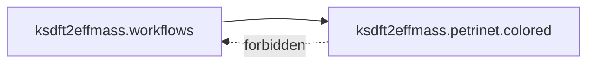

# `ksdft2effmass.petrinet` package

`ksdft2effmass.petrinet` is the prospective namespace for generic Petri-net
semantics. Architecture v2 currently selects one owned subpackage:
[`ksdft2effmass.petrinet.colored`](colored/index.md).

The parent package adds no workflow, calculator, authority, persistence, or
scientific-policy behavior. Exact internal modules remain deferred.
