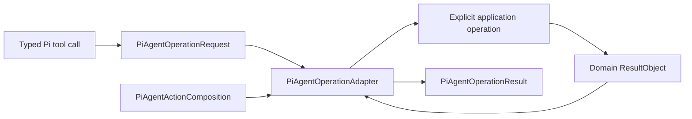

# `ksdft2effmass.pi.agents` package

## Responsibility

`ksdft2effmass.pi.agents` is the prospective deterministic adapter between a
restricted Pi agent profile and explicitly composed project operations. It owns
Pi-facing request and result envelopes, closed action-composition identity,
transport validation, tool-to-operation adaptation, bounded invocation, and
Pi-specific failure mapping.

The repository-wide [agent system](../../../agents/index.md) owns role,
capability, isolation, and self-improvement policy. Domain packages own the
operations exposed through this adapter.

## Boundary

The names in the diagram are prospective package-level contracts; exact public
fields and internal modules remain deferred.

One immutable action composition binds:

- the operator-profile identity;
- accepted request and result schema versions;
- exact exposed operation identities;
- adapter and application entrypoint identities;
- tool-name-to-operation mappings;
- required capability and isolation profile identities; and
- predecessor or compatibility identity when applicable.

The composition is constructed explicitly before the governed session. It is not
a mutable registry and cannot be extended, replaced, or hot-reloaded by the
operator.

## Adapter operation

For one call, the adapter:

1. validates the closed transport schema and output limits;
2. verifies request, composition, repository-root, runtime, and operation
   identity bindings;
3. maps the accepted request to one explicitly composed application operation;
4. invokes that operation with cancellation, timeout, sanitized environment,
   and bounded output behavior where an outer process boundary is used;
5. validates the returned closed domain result without converting rejection or
   indeterminate outcomes into success; and
6. returns a bounded immutable Pi-facing result referencing the exact domain
   result and applicable provenance identities.

The adapter does not repeat domain validation, reinterpret authorization,
construct successor state, persist Harness or Workflow aggregates, infer human
approval, or classify scientific findings.

## Public object direction

The package may require concrete immutable records and target-first ActionObjects
such as:

| Prospective object | Responsibility |
|---|---|
| `PiAgentOperationRequest` | Immutable typed transport request |
| `PiAgentActionComposition` | Immutable closed mapping from exposed Pi actions to exact application operations |
| `PiAgentOperationAdapter` | Validate, map, invoke, and preserve the domain result boundary |
| `PiAgentOperationResult` | Closed structured transport observation |

These names do not select generic `ActionRequest`, `ActionObject`,
`ActionRegistry`, `ActionPolicy`, `ActionDispatcher`, or `ActionResult` base
classes. Domain requests and results remain concrete and composition-based.

## TypeScript extension relationship

A project Pi extension may register typed tools and call this package through an
exact bounded entrypoint. That extension is thinner than this adapter: it owns
Pi API mechanics only and contains no domain transition, authorization,
persistence, validation, or promotion policy. Extension discovery is disabled
for a governed profile and only the identified approved adapter is loaded.

The extension and Python package are trusted executable code. Pi tool selection
confines model requests but does not sandbox either implementation; the
[capability and isolation contract](../../../agents/capability-and-isolation.md)
applies.

## Prohibitions

This package owns no:

- HarnessState or WorkflowRun authority;
- DevelopmentAuthorityLedger reconstruction policy;
- scientific CPN enablement or firing;
- repository or calculator effect semantics;
- agent-authored code promotion;
- dynamic action discovery or registration;
- general shell, patch, or arbitrary module execution; or
- Pi session lifecycle as authoritative project state.

## Status and deferred details

`ksdft2effmass.pi.agents` is selected prospectively and unimplemented. Exact
wire fields, serialization, exception forms, internal modules, executable
entrypoint, profile resource format, supported Pi version contract, TypeScript
extension path, process boundary, and deployment mechanism remain deferred. No
source, extension, dependency, launcher, or operator activation is authorized by
this page.
