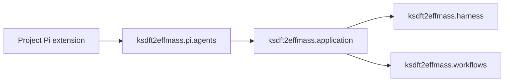

# `ksdft2effmass.pi` package

## Responsibility

`ksdft2effmass.pi` is the prospective outer integration namespace for
project-owned deterministic adapters to the Pi coding-agent runtime. It depends
inward on explicit application and domain contracts; no domain package depends
on Pi.

This namespace does not embed Pi, implement an agent runtime, own model prompts,
replace Pi extension APIs, or make Pi lifecycle state authoritative. Pi remains
an external runtime. Project `.pi` resources remain runtime configuration and
adapters rather than Python package state.

## Selected subpackage

Architecture v2 initially selects one subpackage:

- [`ksdft2effmass.pi.agents`](agents/index.md) owns typed Pi-facing operation
  adaptation and closed result transport for governed agents.

No generic plugin system, model provider, subagent runtime, launcher framework,
or mutable action registry is selected.

## Dependency direction



Forbidden reverse imports include:

```text
ksdft2effmass.application ✗→ ksdft2effmass.pi
ksdft2effmass.harness ✗→ ksdft2effmass.pi
ksdft2effmass.workflows ✗→ ksdft2effmass.pi
ksdft2effmass.persistence ✗→ ksdft2effmass.pi
```

The adapter may invoke application composition but cannot become the owner of
application, harness, workflow, persistence, authority, or scientific policy.

## Status

The package is selected prospectively and is not implemented. Exact internal
modules, wire fields, command entrypoints, TypeScript bridge location, packaging,
and runtime dependency mechanism remain deferred. This page authorizes no source
creation, Pi extension installation, dependency change, or operator launch.
