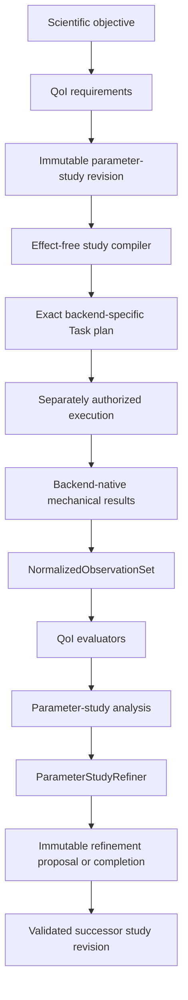

# Plane-wave quantities of interest and parameter studies

## Status and decision

This page records the human-selected Architecture v2 direction for backend-neutral
plane-wave studies. It is an architecture and software-contract decision, not a
selection of physical or numerical settings and not authorization to execute a
calculator.

The selected model is layered and quantity-of-interest (QoI) driven:



A QoI states what scientific quantity is required. It does not select a
calculator, render native input, execute a process, embed a reference target, or
decide scientific acceptance. A parameter study states which controlled factors
are varied, which context remains fixed, which QoIs are evaluated, and which
comparison or stopping policy applies.

## Selected alternatives

Three conceptual architectures were considered:

- **Thin opaque execution:** generic code transports exact native inputs and
  outputs but knows no scientific requirements. This preserves backend freedom but
  cannot plan reusable QoI-driven studies or detect omitted observations before
  execution.
- **Unified electronic-structure input:** one common input object attempts to
  represent every backend setting. This permits uniform dispatch but would grow
  into a union of calculator vocabularies and would encourage false equivalence.
- **Layered capabilities and studies:** common contracts describe scientific
  requirements, parameter-study meaning, and genuinely portable plane-wave
  concepts; calculator-specific records preserve native supplements and exact
  artifacts. This option was selected.

The selection does not introduce a universal electronic-structure executor base.
Execution remains calculator-specific and explicitly injected.

## Quantity-of-interest boundary

`ksdft2effmass.analysis` owns calculator-independent QoI definitions, requirements,
evaluation policy, values, comparison findings, convergence or sensitivity
analysis, and refinement algorithms. A QoI may produce a scalar, vector, tensor,
spectrum, field reference, or represented-operator reference only through an
explicit closed representation owned by the applicable scientific domain. There
is no generic scientific tag dictionary or erased value container.

A QoI definition identifies:

- the represented quantity and intended state space;
- required normalized observations and their completeness;
- units, basis, gauge, energy-reference, geometry, and spin conventions where
  applicable;
- the deterministic evaluator identity and version; and
- represented unavailable, incompatible, incomplete, or evaluation-failure
  outcomes.

Reference data, residual metrics, tolerances, weights, loss functions, and human
acceptance remain separate inputs. The same QoI can consequently participate in a
convergence study, model-sensitivity analysis, backend comparison, or separately
authorized fitting workflow without changing its intrinsic meaning. Architecture
v2 does not add interatomic-potential fitting through this decision.

## Study kinds and factor meaning

A parameter study declares one closed study kind. The kind determines what its
findings may mean:

| Study kind | Representative factors | Permitted conclusion |
|---|---|---|
| Numerical convergence | plane-wave and density cutoffs, integration mesh, state coverage | Stability of declared QoIs over the tested finite settings within one fixed physical/model branch |
| Solver stability | convergence threshold, mixing, diagonalization, initialization strategy | Reliability or cost of reaching the intended represented solution |
| Model sensitivity | pseudopotential, exchange-correlation approximation, occupation interpretation | Dependence of QoIs on declared model choices |
| Physical-branch comparison | spin-polarized versus non-spin-polarized, collinear versus noncollinear, SOC versus non-SOC | Explicit comparison of distinct Hamiltonians or state spaces |
| Operational benchmark | process layout, threads, resource limits | Represented performance under settings demonstrated not to alter the scientific input |

SOC, spin treatment, exchange-correlation approximation, pseudopotential identity,
and constrained magnetization are never cutoff-like convergence factors. Initial
magnetization and smearing must declare their role because each can be either a
solver/numerical device or part of the modeled physical branch. Numerical
convergence requires one exact fixed physical/model identity, and its analyzer
rejects branch drift.

A finite-setting result establishes only observed stability over its tested domain.
It does not establish an infinite-basis error bound unless a separately specified
mathematical error model and evidence support that claim.

## Portable specification and backend supplements

`ksdft2effmass.calculators` owns the backend-neutral plane-wave simulation
specification and calculator-specific input/output contracts. The common
specification is layered:

1. physical/model branch: system, charge, model and exact asset identities,
   occupation interpretation, spin treatment, and relativistic/SOC treatment;
2. numerical discretization: plane-wave and density cutoffs, reciprocal-space
   sampling, and requested state coverage where semantics are shared;
3. solver policy: only controls with demonstrated common meaning;
4. observation requirements: calculator-independent quantities and completeness;
5. typed calculator supplement: exact native controls not represented by the
   portable layers; and
6. execution context: exact executable, environment, workspace, and resource
   limits, owned separately from scientific meaning.

A backend binder consumes the portable specification and its calculator-owned typed
supplement. It produces an exact native plan plus a complete parameter-binding
record, or a closed `unsupported`, `incompatible`, `invalid`, or `error` result.
It may not ignore a requirement, translate by label alone, or conceal a native
default. Application composition explicitly selects the binder; there is no ambient
plugin discovery or mutable registry.

A selected parameter set remains scoped to the complete context that produced it,
including the physical/model identity, exact scientific assets, backend and version
where relevant, QoIs, tolerances, candidate domain, and analysis identity. Equal
labels, converted numeric cutoffs, or nominally matching methods do not establish
portability or backend equivalence.

## Compilation, reuse, and execution

Project-specific study composition belongs to `ksdft2effmass.campaigns`. Campaigns
may consume analysis, calculator, and Workflow contracts to compile an immutable
study revision into exact Task instances and dependencies. It does not own QoI
semantics, calculator behavior, generic Workflow control, or scientific acceptance.

Compilation is deterministic and effect-free for one exact compiler identity and
compilation-operation identity, study revision, QoI requirement mapping, backend
binding set, run-scoped Task-instance set, dependency set, Workflow identity, and
input identity set. Its closed result is `compiled`,
`unsupported`, `incompatible`, `invalid`, or `error`. A failed result contains no
partially executable candidate plan and retains the complete request plus the
compiler identity that actually rejected it. A successful result likewise retains
the complete request, rather than reducing provenance to reusable Task-definition
identities.

Before producing a plan, the compiler proves that every study criterion has one
typed QoI definition, every normalized observation requirement has an explicit
calculator-vocabulary binding, and every candidate specification requests all of
those calculator observations. The compiler may merge work required by multiple
QoIs or candidates only when the complete simulation specifications and backend
bindings are equal. Nominal binding-identity equality, matching names, or selected
parameter values are insufficient. Distinct complete bindings cannot share a Task
instance; equal complete bindings reuse the same Task instance and record every
reuse edge explicitly.

Workflow control continues to own Task activation, dispatch preparation, result
ingress, replay, and normalized-observation correlation. Calculator execution
continues to require the separately owned exact authorization and one grant per
exact dispatch. Study compilation, QoI evaluation, a refinement proposal, or a
campaign-level resource envelope grants no execution authority.

## Adaptive refinement extension

Adaptive refinement is represented as immutable successor revisions rather than
mutation of an executing study. `ParameterStudyRefiner` is a nominal abstract
ActionObject owned by analysis. Concrete algorithms inherit from it and implement
one target-first operation over an explicit request:

```python
class ParameterStudyRefiner(ABC):
    @property
    @abstractmethod
    def refinement_identity(self) -> RefinementAlgorithmIdentity: ...

    @property
    @abstractmethod
    def configuration_identity(self) -> RefinementConfigurationIdentity: ...

    @abstractmethod
    def execute(
        self,
        request: ParameterStudyRefinementRequest,
    ) -> ParameterStudyRefinementResult: ...
```

The initial private and revisable probe supplies one concrete finite monotone-sequence
refiner. Later algorithms may be added without changing study or Workflow state.
Implementations are explicitly constructed and injected; subclassing does not
register them.

The request binds the exact immutable study revision, completed candidate
evaluations, QoI definitions and normalized observation requirements, declared
factor domain, stopping criteria, remaining candidate budget, exact algorithm and
configuration identities, and predecessor refinement-state snapshot. The closed
result is `complete`, `proposed`, `insufficient_information`, `unsupported`,
`invalid`, or `error`. A proposed result contains the next declared candidate and a
new immutable state whose predecessor identity names the request state.

Algorithm configuration may be immutable instance state. Evolving brackets, tested
points, rejected candidates, numerical state, and history are immutable request/result
records or content-identified artifact references, never hidden mutable state on the
refiner. Stochastic algorithms require explicit seed/state and reproducibility
metadata before their results can participate in deterministic study revision.

A proposal validator, separate from every concrete algorithm, independently checks
evaluation-prefix closure, predecessor-state closure, factor domain, fixed-branch
closure, next-candidate order, required QoIs, exact algorithm/configuration/revision
correlation, budget, a distinct successor-state identity, and exact state lineage.
Only a valid proposal may become a new study revision and be compiled. Backend
compatibility is established later by the effect-free campaign compiler. Neither
step automatically executes or enlarges an authorized campaign envelope.

## Persistence and provenance

Durable study history is append-only by identity:

- study definition and revision;
- candidate specifications and backend bindings;
- complete compilation request, run-scoped Workflow composition, explicit Task
  dependencies, and explicit reuse edges;
- exact Task, attempt, grant, process, result, and artifact lineage when execution is
  separately authorized;
- normalized observation and QoI-evaluation identities;
- comparison and parameter-study analysis;
- refinement request, algorithm/configuration/state, and result; and
- any later human scientific decision citing an exact recommended candidate.

WorkflowRun persistence remains Workflow-owned. Scientific analysis and findings
remain analysis-owned. Human-reviewed parameter selection remains an external
scientific decision and applicable frozen specification; an analyzer result does not
create acceptance. Large native data and large algorithm state remain external
content-identified artifacts.

## Failure and recovery

Unsupported backend capability, incompatible assets, incomplete observations,
branch drift, invalid candidates, exhausted budget, algorithm failure, compilation
failure, rejected dispatch, and indeterminate execution remain distinct represented
states. None is converted into a missing candidate, default value, converged result,
or automatic retry.

Retry or adaptive continuation creates new operation, attempt, proposal, study
revision, WorkflowRun, dispatch, and grant identities as applicable. Previously
completed revisions and findings are never rewritten. A later algorithm may consume
retained compatible results, but compatibility is established explicitly rather than
by filename or parameter label.

## Initial stabilization and public package boundary

The first implementation was accepted as a private, revisable, synthetic probe. It
demonstrates:

- one fixed physical/model identity;
- one finite monotone numerical-factor sequence;
- one scalar QoI with an explicit numerical criterion and typed normalized
  observation requirement;
- explicit analysis-to-calculator observation mapping and completeness checks;
- immutable candidate evaluation and refinement-state records with exact
  predecessor lineage;
- complete run-scoped Task-instance composition, dependencies, and reuse records;
- the nominal `ParameterStudyRefiner` ABC and one concrete subclass;
- successor proposal and stopping results;
- rejection of physical-branch drift and invalid candidate ordering; and
- no wire format, native input rendering, calculator invocation, protected execution,
  production parameter selection, backend-equivalence claim, scientific validation,
  or uncertainty quantification.

The later accepted
[plane-wave DFT and QE package-ownership decision](calculators/quantum-espresso-package-ownership-decision.md)
authorizes the demonstrated portable specification, binding records, and structural
calculator port as the public Python package
`ksdft2effmass.calculators.dft.pw`. It places QE-specific public contracts and
behavior in `ksdft2effmass.integration.quantum_espresso`. This promotion changes no
scientific meaning, selects no production parameter, and grants no execution
authority. Public serialization and cross-language contracts remain deferred.
