# QoI-first calculator integration and LAMMPS

## Status

This page records the ordering and ownership boundary for adapting useful ideas from
`pypospack` into Architecture v2. The initial public scalar QoI definition, successful/failed evaluation ResultObjects,
and calculated DFT reference-target records are implemented in
`ksdft2effmass.analysis`. This page authorizes no LAMMPS execution, does not select an
interatomic potential or material-property model, and does not claim that a LAMMPS
integration is implemented.

The ordering applies to new LAMMPS-specific public contracts. It does not erase or
rewrite the already implemented generic Workflow `Task`, structural `Simulation`
protocol, dispatch, authority, or result-ingress foundations.

## Legacy source inspected

The inspected upstream boundary is
[`eragasa/pypospack`](https://github.com/eragasa/pypospack/tree/21cdecaf3b05c87acc532d992be2c04d85bfbc22)
commit `21cdecaf3b05c87acc532d992be2c04d85bfbc22` (2019-12-06), licensed
under MIT. Relevant files include:

- [`pypospack/qoi.py`](https://github.com/eragasa/pypospack/blob/21cdecaf3b05c87acc532d992be2c04d85bfbc22/pypospack/qoi.py)
  and [`pypospack/qois/qoi_manager.py`](https://github.com/eragasa/pypospack/blob/21cdecaf3b05c87acc532d992be2c04d85bfbc22/pypospack/qois/qoi_manager.py);
- [`pypospack/pyposmat/engines/engine.py`](https://github.com/eragasa/pypospack/blob/21cdecaf3b05c87acc532d992be2c04d85bfbc22/pypospack/pyposmat/engines/engine.py);
- [`pypospack/task/task_manager.py`](https://github.com/eragasa/pypospack/blob/21cdecaf3b05c87acc532d992be2c04d85bfbc22/pypospack/task/task_manager.py);
- [`pypospack/task/lammps.py`](https://github.com/eragasa/pypospack/blob/21cdecaf3b05c87acc532d992be2c04d85bfbc22/pypospack/task/lammps.py); and
- [`pypospack/task/tasks_lammps/abstract_lammps_task.py`](https://github.com/eragasa/pypospack/blob/21cdecaf3b05c87acc532d992be2c04d85bfbc22/pypospack/task/tasks_lammps/abstract_lammps_task.py).

Observed legacy behavior is conceptually valuable: a QoI declaration determines the
required calculation tasks, shared tasks are deduplicated, tasks are configured, the
calculator is run, and task results are then reduced to QoI values. In particular,
`PyposmatEngine.configure()` constructs the QoI plan before constructing the task
manager.

Architecture v2 adopts that dependency direction, not the legacy implementation.
It does not adopt mutable manager objects, string-keyed result dictionaries, dynamic
module/class registries, ambient `LAMMPS_BIN` lookup, process-wide current-directory
changes, or a single object that combines scientific planning, process execution,
parsing, and QoI evaluation. The public QoI records are a new implementation under
this project's license; no upstream source was copied into them. Any later substantial
source reuse must retain the applicable MIT notice and receive the required licensing
review.

## Required definition order

New calculator support is defined in this order:

1. **QoI meaning.** Define the calculator-independent quantity, normalized
   observation requirements, units and conventions, evaluator identity, completeness,
   and closed evaluation outcomes.
2. **Calculator capability and native binding.** Define the calculator-neutral
   atomistic observation vocabulary needed by those QoIs, followed by exact
   LAMMPS-native supplements, input/result records, and fail-closed bindings. This
   stage is immutable and effect-free.
3. **QoI-to-Task compilation.** Compile exact QoI requirements and backend bindings
   into an immutable run-scoped Task plan. Reuse is allowed only when complete
   specifications and bindings are equal; matching names are insufficient.
4. **Simulation execution.** Only after the preceding contracts are fixed may a
   LAMMPS-specific Simulation Task, executor, workspace, process, parser, diagnostic,
   retry, and result-ingress adapter be defined.
5. **QoI evaluation.** After confirmed result ingress and explicit normalization, an
   analysis-owned evaluator produces a typed QoI value or closed failure result.

```mermaid
flowchart LR
    qoi["QoI definition"] --> requirements["Normalized observation requirements"]
    requirements --> atomistic["Calculator-neutral atomistic specification"]
    atomistic --> binding["Exact LAMMPS binding"]
    binding --> compiler["Effect-free campaign compiler"]
    compiler --> tasks["Run-scoped Task plan"]
    tasks --> simulation["Separately authorized LAMMPS Simulation Task"]
    simulation --> native["LAMMPS-native ResultObject"]
    native --> normalized["NormalizedObservationSet"]
    normalized --> evaluator["QoI evaluator"]
```

This ordering prevents a Simulation class or native input template from becoming the
de facto definition of a scientific quantity.

## Ownership

| Concern | Owner |
|---|---|
| Calculator-independent QoI definition, evaluator, typed value/failure, units, conventions, and scientific comparison policy | `ksdft2effmass.analysis` |
| Backend-neutral atomistic simulation requirements, exact backend-binding references, closed binding outcomes, and any demonstrated narrow structural calculator port | `ksdft2effmass.calculators` |
| Project-specific mapping from QoIs and structures to exact run-scoped Task plans and explicit reuse edges | `ksdft2effmass.campaigns` |
| LAMMPS input grammar, units style, atom style, boundary conditions, potential artifact references, native operations, native results, executable configuration, diagnostics, staging, workspace, process invocation, parsing, and normalization adapters | `ksdft2effmass.integration.lammps` |
| Generic Task, Simulation protocol, activation, authority, dispatch, result ingress, replay, and `NormalizedObservationSet` correlation | `ksdft2effmass.workflows` |
| Explicit selection and injection of the LAMMPS binder, compiler inputs, executor, evaluator, repositories, and configuration | `ksdft2effmass.application` |

Analysis does not import calculator or integration packages. Calculators do not import
integrations. Workflows do not import calculator or integration packages. A LAMMPS
integration may depend inward on the exact calculator, Workflow, and periodic
contracts it implements or consumes. Application composition is the only selection
root; there is no ambient plugin discovery or mutable registry.

## Object boundaries

The QoI is an immutable DataObject. Its normalized observation requirements are part
of its scientific contract, but reference targets, tolerances, weights, fitting loss,
and human acceptance are separate inputs. A QoI must not return a native LAMMPS task
name or calculator input template.

A QoI evaluator is a target-first analysis ActionObject. It consumes one exact QoI
definition and admitted normalized observations and returns an immutable typed value
or a closed unavailable, incomplete, incompatible, invalid, or error ResultObject. It
performs no process execution and does not mutate the QoI definition.

A LAMMPS backend binder is an integration-owned ActionObject. It consumes an exact
calculator-neutral atomistic specification and one exact LAMMPS supplement and
returns either a complete native binding or a closed unsupported, incompatible,
invalid, or error result. It may not silently use LAMMPS defaults or infer equivalence
from labels.

A future LAMMPS Simulation Task is operation-specific. Static evaluation, positional
relaxation, cell relaxation, elastic response, molecular dynamics, or another native
operation are not variants of one mutable task mode unless an accepted contract proves
that they share one input and result meaning. One external invocation requires one
exact Task activation, attempt, authorization, grant, claim, dispatch outcome, and
result ingress.

## Retained and deferred QoIs

The legacy repository contains implementations for cohesive energy and relaxed-cell
quantities, pressure and elastic components, phase ordering, defect formation energy,
surface and stacking-fault energies, and thermal expansion. Their presence is an
observed legacy capability, not evidence that their formulas, reference states,
units, geometry conventions, or intended material systems are accepted here.

The initial public foundation therefore defines generic scalar QoI identity,
requirements, evaluator identity, successful/failed evaluation ResultObjects, and
calculated DFT reference-target records without adopting any of those physical
quantities. Evaluator execution, normalized-observation payloads, and calculator
bindings remain later slices. Each concrete QoI requires an
applicable scientific specification and software/numerical evidence proportional to
its claims.

## Deferred questions

- The first project-relevant concrete LAMMPS QoI and native operation.
- Whether demonstrated multi-backend need warrants a named
  `ksdft2effmass.calculators.atomistic` public subpackage or only calculator-owned
  private contracts initially.
- Exact periodic-structure and interatomic-potential records consumed by LAMMPS.
- Public serialization, schema versions, compatibility policy, and migration.
- Process, scheduler, resource, retry, and artifact-retention contracts.
- Numerical verification, scientific validation, and uncertainty treatment for each
  later concrete QoI.

Until those questions are resolved, the implemented slice stops at the public scalar
QoI DataObjects, evaluation ResultObjects, and DFT reference-target DataObject. It adds no dependency, ports no legacy code,
defines no LAMMPS Simulation class, and authorizes no calculation.
