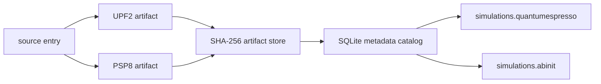

# `ksdft2effmass.simulations.dft`

`ksdft2effmass.simulations.dft` owns backend-neutral DFT simulation composition for
pseudopotentials. It distinguishes:

- a source-library element entry;
- each exact native-format artifact representing that entry;
- its deterministic content-addressed external location;
- its compact SQLite catalog record; and
- a current local-byte verification observation.

The source-entry relationship records common library provenance; it does not assert
byte identity, parser equivalence, numerical agreement, or aligned finite operators.
Every artifact has an independent complete SHA-256.

The external layout separates authoritative content-addressed payloads, compact set
manifests, schema-v1 catalog state, non-authoritative backend views, and mutable
incoming staging. Initialization is non-destructive and rejects another represented
schema version. Recording is insert-only through the public API and verifies an
already-installed regular file's size and complete SHA-256 before storing metadata.
Resolution performs no byte check, so run preparation uses the separate verifier.

The package performs no network access, acquisition, decompression, payload copying,
format conversion, view publication, calculator invocation, scientific selection,
convergence determination, numerical verification, or scientific validation. The
accepted family and layout are specified in the repository file
`specification/dft-pseudopotential-library/v1/index.md`.
