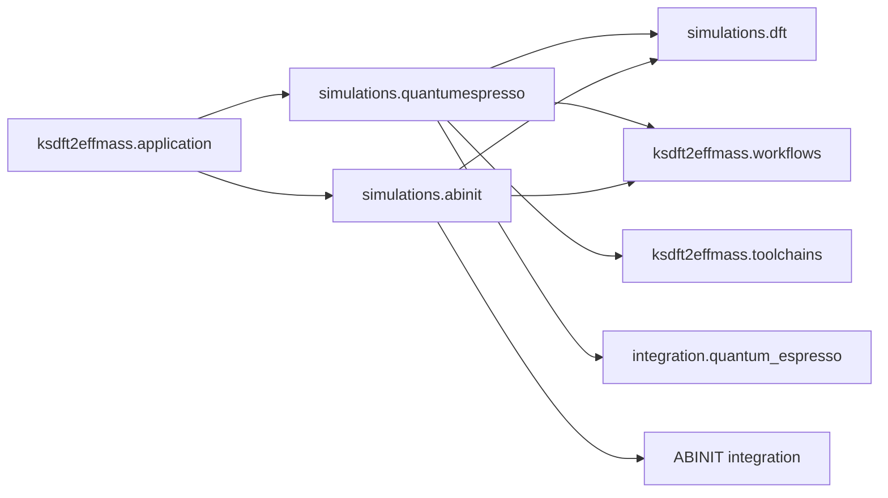

# `ksdft2effmass.simulations` package

The `ksdft2effmass.simulations` package owns project-specific executable-backed
Workflow simulation composition. It sits above generic Workflow, toolchain, and
native-tool integration boundaries. The root package deliberately re-exports no
subdomain API; supported imports use one explicit `simulations.dft`,
`simulations.quantumespresso`, or `simulations.abinit` route.

## Owned domains

- [`simulations.dft`](dft.md) owns backend-neutral pseudopotential source entries,
  independently identified native artifacts, content-addressed storage layout,
  compact SQLite catalog mechanics, and current local-byte verification.
- [`simulations.quantumespresso`](quantumespresso.md) owns QE-specific run identity,
  execution-free build composition, and UPF2 pseudopotential binding.
- [`simulations.abinit`](abinit.md) owns ABINIT-specific composition and PSP8
  pseudopotential binding.

The simulation layer may compose public Workflow, toolchain, pseudopotential, and
integration contracts. It does not own calculator-native parser meaning, protected
execution grants, scientific convergence, cross-format numerical equivalence, or
scientific acceptance.

Executable, input, pseudopotential, resource, authorization, and attempt provenance
remain explicit. A represented identity or plan performs no ambient clock access,
path discovery, download, workspace creation, software installation, or calculator
invocation unless its specific public contract states otherwise.
