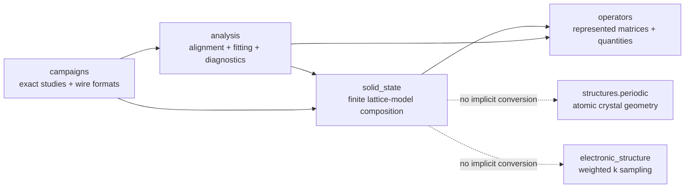

# `ksdft2effmass.solid_state` package

The human-selected solid-state aggregate owns reusable composition contracts for
reduced finite lattice models. The initial implemented slice contains:

- dimension-specific `Lattice1D`, `Lattice2D`, and `Lattice3D` compositions with
  physical `DirectLattice*D` and `ReciprocalLattice*D` records;
- all one, five, and fourteen 1D/2D/3D Bravais classifications factored into
  dimension-specific lattice systems and conventional-cell `P/C/I/F/R` centering;
- caller-toleranced direct--reciprocal analysis for $A B^{\mathsf T}=2\pi I$;
- closed one-, two-, and three-dimensional integer lattice coordinates,
  displacements, finite periodic shapes, and last-axis-fastest indexing;
- explicit periodic wrapping and retained boundary-crossing quotients;
- unreduced boundary-twist lifts, quotient representatives, tensor-product meshes,
  and declared gauge representations;
- scalar translation-invariant hopping inventories with units, energy references,
  and basis identities;
- localized scalar onsite and bond perturbations; and
- explicit unimodular lattice operations, coordinate/twist transforms, and signed
  axis-permutation shape compatibility.

## Boundary

Lattice coordinates are integer cell labels, not Cartesian atomic positions. Boundary
twists are unweighted finite-domain boundary conditions, not
`KPointSampling`. Equal cell counts do not imply equal shapes. A twist lift and its
quotient representative remain different represented values.

The package does not own DFT or Wannier execution, native formats, atomic structure,
weighted reciprocal integration, model-class fitting, alignment inference, finite-size
acceptance, campaign orchestration, protected execution, scientific validation, or
uncertainty quantification. Those responsibilities remain with their established
owners.

## Implementation status

The current initial slice implements dimension-specific direct, reciprocal, composed,
and Bravais lattice records plus deterministic geometry, twist, duality, and
lattice-operation actions. Bravais construction validates allowed system--centering
pairs; tolerance-dependent metric classification remains a separate planned analyzer.
Sparse complex twisted-supercell construction, gauge
bridges, folding, locality analysis, spectral diagnostics, finite-domain ResultObjects,
serializers, and campaign Workflows remain planned. Multi-orbital, spin, composite,
nonorthogonal-lattice, and atomic-to-reduced-model contracts remain deferred.

The complete bounded extraction inventory is
[the finite-domain solid-state extraction inventory](../finite-domain-solid-state-extraction-inventory.md).
The package-ownership alternatives and selected aggregate boundary are retained in
[the architecture decision](../finite-domain-solid-state-extraction-decision.md).
The bounded source and evidence assessment is retained in the
[initial implementation adversarial review](initial-implementation-review.md).
