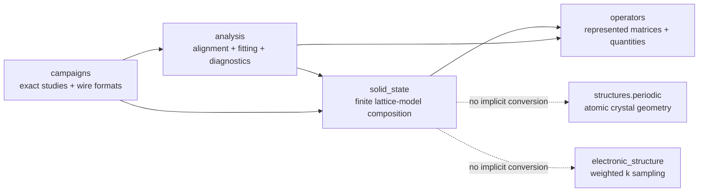

# `ksdft2effmass.solid_state` package

The human-selected solid-state aggregate owns reusable composition contracts for
reduced finite lattice models. The initial implemented slice contains:

- dimension-specific `Lattice1D`, `Lattice2D`, and `Lattice3D` compositions with
  physical `DirectLattice*D` and `ReciprocalLattice*D` records and correlated passing
  analysis results;
- all one, five, and fourteen 1D/2D/3D Bravais classifications factored into
  dimension-specific lattice systems and conventional-cell `P/C/I/F/R` centering;
- caller-toleranced direct--reciprocal analysis for $A B^{\mathsf T}=2\pi I$ and
  caller-toleranced conventional-cell metric compatibility;
- closed one-, two-, and three-dimensional integer lattice coordinates,
  displacements, finite periodic shapes, and last-axis-fastest indexing;
- explicit periodic wrapping and retained boundary-crossing quotients;
- unreduced boundary-twist lifts, quotient representatives, tensor-product meshes,
  and declared gauge representations;
- scalar translation-invariant hopping inventories with units, energy references,
  and basis identities;
- localized scalar onsite and bond perturbations;
- one-dimensional centered reciprocal meshes, ordered plane-wave bases, and explicit
  finite-cutoff reciprocal sewing maps;
- scalar or composite reciprocal band-frame paths and polar parallel transport;
- canonical one-dimensional Wilson eigenphase multisets, explicit phase-to-center
  convention, and optimal circular phase-set comparison;
- projected reciprocal operator samples, complete scalar or block Fourier transforms,
  inverse interpolation, and symmetric finite-range truncation; and
- explicit unimodular lattice operations, coordinate and displacement transforms,
  signed-axis-permutation twist transforms, and shape compatibility.

## Boundary

Lattice coordinates are integer cell labels, not Cartesian atomic positions. Boundary
twists are unweighted finite-domain boundary conditions, not
`KPointSampling`. Equal cell counts do not imply equal shapes. A twist lift and its
quotient representative remain different represented values.

The package does not own DFT or Wannier execution, native formats, atomic structure,
weighted reciprocal integration, model-class fitting, alignment inference, finite-size
acceptance, campaign orchestration, protected execution, scientific validation, or
uncertainty quantification. Those responsibilities remain with their established
owners.

## Implementation status

The current initial slice implements dimension-specific direct, reciprocal, composed,
and Bravais lattice records plus deterministic geometry, twist, duality, metric, and
lattice-operation actions. Bravais construction validates allowed system--centering
pairs; `BravaisMetricCompatibilityAnalyzer` separately checks required normalized
metric invariants using a caller-provided tolerance and does not infer a unique
maximal-symmetry classification. Composed `Lattice*D` records require correlated
passing duality and metric results. General unimodular coordinate operations remain
valid for coordinates and displacements, while twist transformation is deliberately
restricted to signed axis permutations; a future general twist transform would need
the contragredient operation $M^{-\mathsf T}$.

Implementation is separated by responsibility: `bravais.py` owns classifications and
metric compatibility, `lattices.py` owns direct, reciprocal, and verified composed
records, and `duality.py` owns direct--reciprocal analysis.

The dependency-owned immutable ``ComplexSparseMatrixQuantity`` provides canonical
complex128 CSR storage and an explicit dense boundary.
``ScalarFiniteLatticeOperator`` correlates that matrix state with scalar one-state-per-
cell geometry, ordering, twist, gauge, basis, unit, energy-reference, and provenance
metadata. ``ComplexSparseHermiticityAnalyzer`` supplies nondensifying, caller-
toleranced fixed-representation analysis. ``TwistedSupercellOperatorConstructor``
assembles the translation-invariant scalar parent directly into canonical CSR in the
centered uniform-link gauge while retaining the unreduced twist lift.
``LocalizedPerturbationOperatorConstructor`` separately assembles declared onsite and
directed bond terms without inventing Hermitian reverses.
``TwistGaugeBridgeConstructor`` builds the unitless site-diagonal transformation from
uniform-link to quotient-seam gauge with the declared relation
$H_{\mathrm{seam}}=U H_{\mathrm{uniform}}U^\dagger$.
``TwistGaugeEquivalenceAnalyzer`` then checks shape, fiber, basis, unit, and energy-zero
compatibility before evaluating a sparse maximum-absolute residual.
``QuotientSeamOperatorConstructor`` independently resolves quotient-image integers for
hopping and localized terms without calling uniform-link construction or a bridge; its
small software oracles are hand-derived.
``ScalarFiniteLatticeOperatorCompatibilityAnalyzer`` checks shape, fiber, basis, unit,
and energy-reference identity before ``ScalarFiniteLatticeOperatorAdder`` composes
parent and perturbation matrices without densification.
``ScalarFiniteLatticeRouteReconciliationWorkflow`` constructs both routes for one case
and retains separate parent, perturbation, and full-operator equivalence results.
Software evidence covers synthetic 1D and 2D finite-lattice cases and independently
authored periodic-1D reciprocal-path examples. Appendix G extraction adds composite
band frames and matrix-valued hopping blocks without changing the scalar finite-domain
operator contract. ``WilsonLoopSpectrum1D`` stores principal phases as an unordered
canonical multiset; its comparator uses minimum-total-absolute circular assignment and
does not infer band labels, loop orientation, polarization, or a topological invariant.
Spin, nonorthogonal-lattice, atomic-to-reduced-model, and Appendix H multidimensional
band-reduction contracts remain deferred.

The complete bounded extraction inventory is
[the finite-domain solid-state extraction inventory](../finite-domain-solid-state-extraction-inventory.md).
The package-ownership alternatives and selected aggregate boundary are retained in
[the architecture decision](../finite-domain-solid-state-extraction-decision.md).
The bounded source and evidence assessment is retained in the
[initial implementation adversarial review](initial-implementation-review.md).
