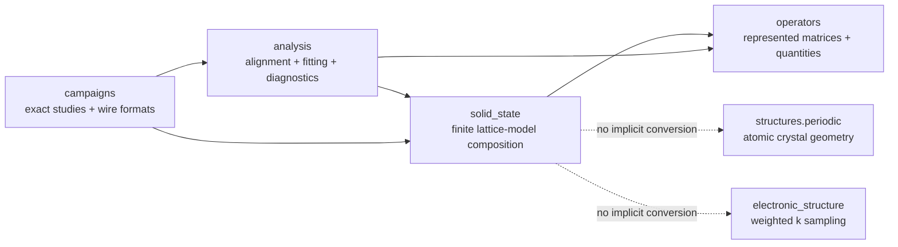

# `ksdft2effmass.solid_state` package

Canonical architecture path: `ksdft2effmass/solidstate/`.

Audited numerical child pages include
[reciprocal samples and hopping transforms](hoppingtransforms/index.md) and
[specialized sparse represented operators](representedoperators/index.md).

The human-selected solid-state aggregate owns reusable composition contracts for
reduced finite lattice models. The initial implemented slice contains:

- dimension-specific `Lattice1D`, `Lattice2D`, and `Lattice3D` compositions with
  physical `DirectLattice*D` and `ReciprocalLattice*D` records and correlated passing
  analysis results;
- all one, five, and fourteen 1D/2D/3D Bravais classifications factored into
  dimension-specific lattice systems and conventional-cell `P/C/I/F/R` centering;
- caller-toleranced direct--reciprocal analysis for $A B^{\mathsf T}=2\pi I$ and
  caller-toleranced conventional-cell metric compatibility;
- closed one-, two-, and three-dimensional integer lattice coordinates,
  displacements, finite periodic shapes, and last-axis-fastest indexing;
- explicit periodic wrapping and retained boundary-crossing quotients;
- unreduced boundary-twist lifts, quotient representatives, tensor-product meshes,
  and declared gauge representations;
- scalar translation-invariant hopping inventories with units, energy references,
  and basis identities;
- localized scalar onsite and bond perturbations;
- one-dimensional centered reciprocal meshes, ordered plane-wave bases, and explicit
  finite-cutoff reciprocal sewing maps with
  $S_{nm}=\delta_{m,n+1}$ for $k\mapsto k+G$; the out-of-cutoff coefficient is
  discarded, so this represented map is nonunitary and distinct from exact sewing on
  the untruncated parent space;
- scalar or composite reciprocal band-frame paths and polar parallel transport;
- canonical one-dimensional Wilson eigenphase multisets, explicit phase-to-center
  convention, and optimal circular phase-set comparison;
- projected reciprocal operator samples, complete scalar or block Fourier transforms,
  inverse interpolation, and symmetric finite-range truncation;
- the explicitly frozen eight-parameter, spinless, orthogonal, nearest-neighbor
  ten-orbital $sp^3s^*$ effective-model class for diamond silicon, including its
  real-space operator components and positive-phase cell-periodic Bloch construction;
- same-frame three-dimensional Wannier construction of represented Hamiltonian,
  canonical kinetic, and explicitly named non-kinetic remainder meshes from supplied
  parent-band coefficients and frame factors;
- finite Wigner–Seitz interpolation of those three same-frame operators and analytic
  Cartesian value, gradient, and Hessian construction for one identified represented
  operator; and
- explicit unimodular lattice operations, coordinate and displacement transforms,
  signed-axis-permutation twist transforms, and shape compatibility.

## Boundary

Lattice coordinates are integer cell labels, not Cartesian atomic positions. Boundary
twists are unweighted finite-domain boundary conditions, not
`KPointSampling`. Equal cell counts do not imply equal shapes. A twist lift and its
quotient representative remain different represented values.

The package does not own DFT or Wannier execution, native formats, artifact authority,
weighted reciprocal integration, model-class fitting, Wannier-to-tight-binding
alignment inference, finite-size acceptance, campaign orchestration, protected
execution, scientific validation, or uncertainty quantification. Atomic structures
remain outside this package; the fixed fractional diamond geometry embedded in the
silicon effective-model class is part of that model definition rather than a reusable
atomic-structure authority. Those responsibilities remain
with their established owners. The same-frame kinetic construction consumes explicit
plane-wave/spinor coefficient coordinates and canonical kinetic energies only after an
integration owner has established their FFT, reciprocal-vector, normalization, unit,
and ordered-k-point conventions. Its represented non-kinetic remainder is not thereby
a continuous scalar potential. Wigner–Seitz inventory identity, native decoding,
source binding, and production provenance likewise remain integration responsibilities;
the solid-state package does not infer them from representative counts or degeneracies.

## Implementation status

The current initial slice implements dimension-specific direct, reciprocal, composed,
and Bravais lattice records plus deterministic geometry, twist, duality, metric, and
lattice-operation actions. Bravais construction validates allowed system--centering
pairs; `BravaisMetricCompatibilityAnalyzer` separately checks required normalized
metric invariants using a caller-provided tolerance and does not infer a unique
maximal-symmetry classification. Composed `Lattice*D` records require correlated
passing duality and metric results. General unimodular coordinate operations remain
valid for coordinates and displacements, while twist transformation is deliberately
restricted to signed axis permutations; a future general twist transform would need
the contragredient operation $M^{-\mathsf T}$.

Implementation is separated by responsibility: `bravais.py` owns classifications and
metric compatibility, `lattices.py` owns direct, reciprocal, and verified composed
records, `duality.py` owns direct--reciprocal analysis, and `reciprocal_meshes.py` owns
the dimension-specific half-open reciprocal-mesh DataObjects.

The dependency-owned immutable ``ComplexSparseMatrixQuantity`` provides canonical
complex128 CSR storage and an explicit dense boundary.
``ScalarFiniteLatticeOperator`` correlates that matrix state with scalar one-state-per-
cell geometry, ordering, twist, gauge, basis, unit, energy-reference, and provenance
metadata. ``ComplexSparseHermiticityAnalyzer`` supplies nondensifying, caller-
toleranced fixed-representation analysis. ``TwistedSupercellOperatorConstructor``
assembles the translation-invariant scalar parent directly into canonical CSR in the
centered uniform-link gauge while retaining the unreduced twist lift.
``LocalizedPerturbationOperatorConstructor`` separately assembles declared onsite and
directed bond terms without inventing Hermitian reverses.
``TwistGaugeBridgeConstructor`` builds the unitless site-diagonal transformation from
uniform-link to quotient-seam gauge with the declared relation
$H_{\mathrm{seam}}=U H_{\mathrm{uniform}}U^\dagger$.
``TwistGaugeEquivalenceAnalyzer`` then checks shape, fiber, basis, unit, and energy-zero
compatibility before evaluating a sparse maximum-absolute residual.
``QuotientSeamOperatorConstructor`` independently resolves quotient-image integers for
hopping and localized terms without calling uniform-link construction or a bridge; its
small software oracles are hand-derived.
``ScalarFiniteLatticeOperatorCompatibilityAnalyzer`` checks shape, fiber, basis, unit,
and energy-reference identity before ``ScalarFiniteLatticeOperatorAdder`` composes
parent and perturbation matrices without densification.
``ScalarFiniteLatticeRouteReconciliationWorkflow`` constructs both routes for one case
and retains separate parent, perturbation, and full-operator equivalence results.
Software evidence covers synthetic 1D and 2D finite-lattice cases and independently
authored periodic-1D reciprocal-path examples. Appendix G extraction adds composite
band frames and matrix-valued hopping blocks without changing the scalar finite-domain
operator contract. ``WilsonLoopSpectrum1D`` stores principal phases as an unordered
canonical multiset; its comparator uses minimum-total-absolute circular assignment and
does not infer band labels, loop orientation, polarization, or a topological invariant.
``SiliconDiamondSp3sStarNearestNeighborConstructor`` constructs the exact
seven-displacement real-space support and all eight dimensionless basis operators for
the adopted initial silicon model class. The represented basis is ordered by
sublattice and cubic orbital, omitted hopping channels remain exact zeros, and reverse
blocks are created explicitly. ``SiliconSp3sStarBlochHamiltonianConstructor`` applies
$\exp(+2\pi i\mathbf q\cdot\mathbf R)$ in the cell-periodic orbital gauge without
adding basis-position phases. The authoritative basis, geometry, sign, phase, energy,
and channel conventions are frozen in the
[`sp3s*` nearest-neighbor model specification](../../../../../specification/ksdft2Effmass.silicon-sp3s-star-nearest-neighbor.v1.md).
This is an executable effective-model representation, not a parameter fit, physical
validation, or alignment to a Wannier operator.

``WannierKineticDecompositionConstructor`` composes the supplied disentanglement and
gauge factors as $W(\mathbf{k})=D(\mathbf{k})U(\mathbf{k})$, constructs both
$H^W(\mathbf{k})$ and $T^W(\mathbf{k})$ in that identical frame, and forms only then
the represented non-kinetic remainder. It also retains the exact canonical finite-mesh
three-dimensional Fourier representations and Hermiticity, decomposition, frame, and
round-trip defects. The coefficient orientation, same-frame transformation, energy
semantics, Fourier pair, and diagnostics are authoritative in the
[Wannier kinetic-decomposition specification](../../../../../specification/ksdft2Effmass.wannier-kinetic-decomposition.v1.md).
The action does not decode native files, infer artifact identity, or authorize the
supplied frame as physically adequate.

``WignerSeitzRepresentedOperator3D`` retains one explicit operator role, identity,
source binding, frame, energy reference, inventory, and block family.
``WignerSeitzOperatorInterpolator3D`` evaluates that concrete record, allowing an
explicitly adapted native Hamiltonian to remain a distinct cross-route operator.
``WannierKineticWignerSeitzInterpolator3D`` separately consumes a decomposition and an
explicit ``WignerSeitzInterpolationInventory3D``. It requires complete modulo-mesh
residue coverage and class-size degeneracies, lifts each canonical block by residue,
and interpolates $H^W$, $T^W$, and $R^W$ with the positive phase while retaining
Hermiticity and decomposition defects. The separate
``WannierRepresentedOperatorCartesianDerivativeConstructor3D`` builds analytic
Cartesian values, gradients, and Hessians with explicit energy–length units and
retains Hermiticity and Cartesian Hessian-symmetry diagnostics. The authoritative
phase, degeneracy, residue, lattice, unit, and derivative conventions are frozen in
the [Wigner–Seitz interpolation specification](../../../../../specification/ksdft2Effmass.wigner-seitz-operator-interpolation.v1.md).
The interpolation and derivative actions do not parse native files, establish
production provenance, select a subspace, perform a Löwdin reduction, convert
curvature to effective mass, or establish interpolation or physical convergence.

``WannierKineticDegenerateQuadraticReductionConstructor3D`` consumes the three
same-frame derivative results and a caller-explicit Hamiltonian eigenspace selection,
reference energy, degeneracy tolerance, and selected-space covariance-probe gauge. It
constructs the selected and complementary frames, complementary resolvent, projected
derivatives, total remote Löwdin term, and the kinetic–kinetic,
remainder–remainder, and kinetic–remainder partition. Its unit-carrying diagnostics
separate finite-matrix decomposition, Hermiticity, separation, and covariance defects.
``WannierKineticDegenerateQuadraticModelEvaluator3D`` evaluates the retained Taylor
polynomial at explicit unit-carrying Cartesian reciprocal offsets, while
``WannierKineticDegenerateQuadraticDirectionalContractionConstructor3D`` contracts the
quadratic tensor along explicit normalized directions. These actions retain matrix
units and anti-Hermiticity diagnostics but leave diagonalization and branch
interpretation to the consuming analysis. The authoritative finite reduction is
frozen in the
[degenerate quadratic-reduction specification](../../../../../specification/ksdft2Effmass.degenerate-quadratic-reduction.v1.md).
It does not infer a physical band label, track scalar branches through a degeneracy,
convert curvature to mass, or establish mesh, interpolation, parent-model, or
scientific convergence. Spin-mixing, nonorthogonal-lattice,
atomic-to-reduced-model, and Appendix H multidimensional band-reduction contracts
remain deferred.

The implemented
[band-frame ownership decision](../periodic/band-frame-ownership-decision.md) assigns
the unit-carrying 1D and reduced-coordinate 2D half-open reciprocal-mesh DataObjects to
`solid_state.reciprocal_meshes` and retains represented frame coordinates under
`solid_state.band_frames`. Analysis-owned neighbor and sewing Actions consume the mesh
records without creating a reverse `solid_state -> analysis` dependency. The move
preserves coordinate values, units, ordering, and intrinsic validation behavior and
retains no old-module compatibility aliases.

The complete bounded extraction inventory is
[the finite-domain solid-state extraction inventory](../finite-domain-solid-state-extraction-inventory.md).
The package-ownership alternatives and selected aggregate boundary are retained in
[the architecture decision](../finite-domain-solid-state-extraction-decision.md).
The bounded source and evidence assessment is retained in the
[initial implementation adversarial review](initial-implementation-review.md).
