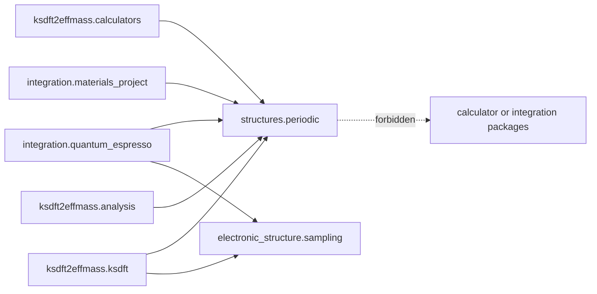

# `ksdft2effmass.structures.periodic` package

The implemented `ksdft2effmass.structures.periodic` package owns backend-neutral
periodic crystal geometry consumed by calculators, integrations, Kohn--Sham records,
and analysis. The selected
[structures package boundary](../structures-package-boundary-decision.md) keeps this
application owner independent of prospective DACP molecular contracts.

The structure owner contains direct and reciprocal lattices, ordered species and
sites, explicit units and coordinate conventions, periodic structures, and the
validator for $A B^T = 2\pi I$. New project-owned direct lattices, Cartesian sites,
and species masses use the canonical LAMMPS `metal` inventory: angstrom and grams
per mole. Electronic $k$-point sampling is implemented by
`ksdft2effmass.electronic_structure.sampling`, not by the structure owner.

`ksdft2effmass.periodic` is a temporary compatibility import with no independent
public class definitions. Existing accepted schema-version-1 plane-wave records
retain Hartree-atomic bohr geometry, unified-atomic-mass values, and a
pseudopotential source label. Those native records are an explicit compatibility
exception and are not the canonical contract for new structures. Their bytes remain
unchanged under the units decision. New canonical `AtomicSpecies` values use grams
per mole and own no pseudopotential assignment.

`ksdft2effmass.integration.materials_project` owns authenticated MPRester access and
immediately snapshots mutable pymatgen structures into the canonical immutable
records. A Materials Project structure is external reference data. In particular,
`mp-149` does not replace the production silicon lattice constant assigned by the
physical specification to a zero-pressure PBE relaxation with the selected
pseudopotential.

The packages do not own calculator invocation, native formats, workflow control,
comparison policy, molecular topology, or scientific acceptance. Private represented
band observations remain outside the new structure owner.
