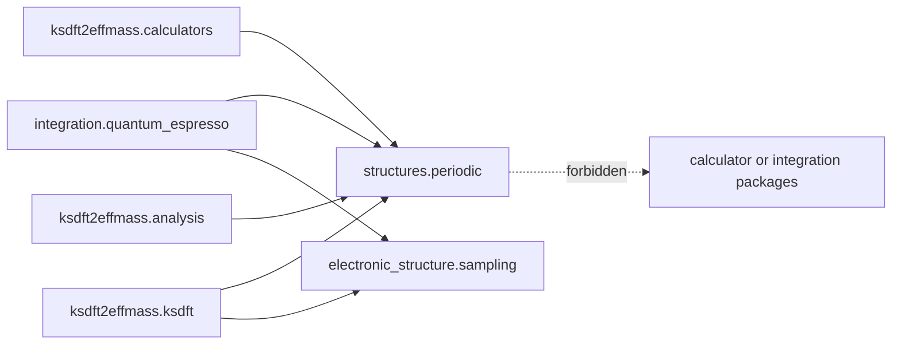

# `ksdft2effmass.structures.periodic` package

The implemented `ksdft2effmass.structures.periodic` package owns backend-neutral
periodic crystal geometry consumed by calculators, integrations, Kohn--Sham records,
and analysis. The selected
[structures package boundary](../structures-package-boundary-decision.md) keeps this
application owner independent of prospective DACP molecular contracts.

The structure owner contains direct and reciprocal lattices, ordered species and
sites, explicit units and coordinate conventions, periodic structures, and the
validator for $A B^T = 2\pi I$. Electronic $k$-point sampling is implemented by
`ksdft2effmass.electronic_structure.sampling`, not by the structure owner.

`ksdft2effmass.periodic` is a temporary compatibility import with no independent
public class definitions. Existing schema-version-1 plane-wave compatibility retains
a pseudopotential source label on `AtomicSpecies`; the label is transitional and is
not reusable structure meaning. Moving it to a plane-wave assignment owner requires
the separately authorized aggregate compatibility migration.

The packages do not own calculator invocation, native formats, workflow control,
comparison policy, molecular topology, or scientific acceptance. Private represented
band observations remain outside the new structure owner.
