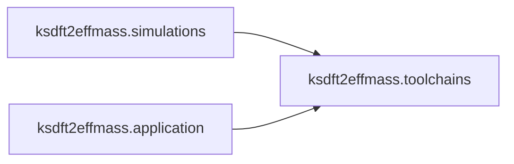

# `ksdft2effmass.toolchains` package

The `ksdft2effmass.toolchains` package owns execution-free declarations and planning
for maintained native compilation toolchains. It represents immutable tool roles,
versions, local paths, content-evidence boundaries, build definitions, isolated roots,
expected outputs, resource ceilings, and deterministic direct argument vectors.



The package does not discover local software, expand home directories, hash files,
download or install dependencies, mutate source or build trees, invoke CMake or a
compiler, authorize a protected operation, or adopt a dependency. A declared SHA-256
value remains an expected identity until a separate observation boundary checks local
bytes. Unpinned content is represented explicitly rather than assigned a fabricated
identity.

The initial QE consumer supplies separate absolute roots corresponding to `~/opt` and
`~/build`. Packages use independent immutable HPC-style prefixes:

```text
~/opt/software/cmake/4.3.3-<platform>/
~/opt/software/gcc/16.1.0-<platform>/
~/opt/software/openmpi/5.0.9-gcc16.1.0-<platform>/
~/opt/software/openblas/0.3.33-gcc16.1.0-<platform>/
~/opt/software/fftw/3.3.11-gcc16.1.0-<platform>/
~/opt/toolchains/tc-<digest-prefix>/manifest.json
~/opt/software/qe/7.2/tc-<digest-prefix>/release-nontrapping/
  build-<digest-prefix>/
~/opt/modules/qe/7.2/release-nontrapping/
  tc-<digest-prefix>-build-<digest-prefix>.lua
~/build/qe/7.2/tc-<digest-prefix>/build-<digest-prefix>/<workspace>/
```

The ``tc-`` identity covers runtime dependencies and excludes the build system. The
separate ``build-`` identity covers build-system provenance, the complete runtime
digest, retained source reference, platform, CMake definitions, target, and expected
outputs. Absolute roots
and logical profile labels are excluded from both identities. Filesystem identities
accept explicit digest-prefix lengths from 12 through 64 characters. A future
installer must compare complete digests and manifests before choosing a prefix; a
collision lengthens the prefix and never overwrites.

Modulefiles are profile- and build-qualified non-authoritative views. Source and
scratch remain outside immutable installation prefixes. Package prefixes include the
exact compiler version and platform but are not yet publication-ready identities:
ABI-relevant variants and verified per-package content must be recorded before any
installation is authorized. The retained non-Git source reference is likewise not a
verified source-content digest. A future installer must use a separate staging prefix,
validate package and build manifests, and atomically promote complete content rather
than installing directly into an immutable final prefix. Planning does not claim that
these paths exist or that any proposed component can be built successfully.

Executable-specific recipe policy belongs to its outward simulation package. Generic
native path, limit, definition, and argument-vector behavior remains here. Native-tool
input/output semantics and runtime execution remain with their integration owners;
application composition owns any later explicitly authorized external effect.
