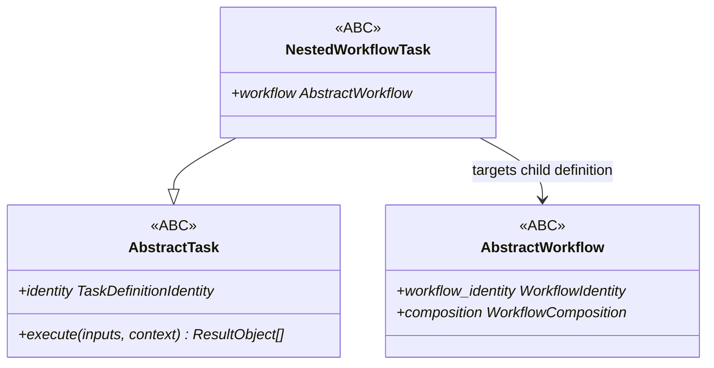
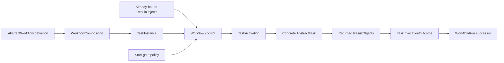
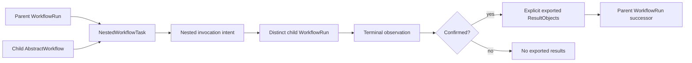

# Scientific Workflow schematic

## Type relationships

There is deliberately no inheritance edge from `AbstractWorkflow` to `AbstractTask`.
The package exposes no structural `Task` or `Workflow` protocols and no compatibility
aliases for them.

## Ordinary Task activation

The Task receives the exact context supplied by Workflow control. It does not discover
its instance, activation, operation, attempt, or authority.

## Nested Workflow activation

A nested adapter does not execute child member Tasks with the parent Task context.
Child creation and parent advancement remain separate identity-correlated commits.
Only a confirmed replay-equal terminal child revision may export explicit results.

## Periodic-1D replay decomposition

```mermaid
flowchart LR
    input[Imported retained inputs] --> adapt[Input adaptation Task]
    adapt --> parent[Parent-model Task]
    parent --> fibers[Parent-fiber sampling Task]
    fibers --> frame[Band-frame transport Task]
    frame --> retained[Retained-space/operator Task]
    retained --> projection[Retained-operator projection Task]
    projection --> hopping[Complete hopping transform Task]
    hopping --> truncate[Range truncation Tasks]
    hopping --> fit[Range fitting Tasks]
    truncate --> compare[Historical comparison Task]
    fit --> compare
    compare --> prepare{Confirmed agreement?}
    prepare -->|yes| artifacts[Artifact preparation Task]
    prepare -->|no| rejected[No prepared artifact output]
```

The root replay Workflow owns this composition but performs none of the represented
scientific operations itself.
