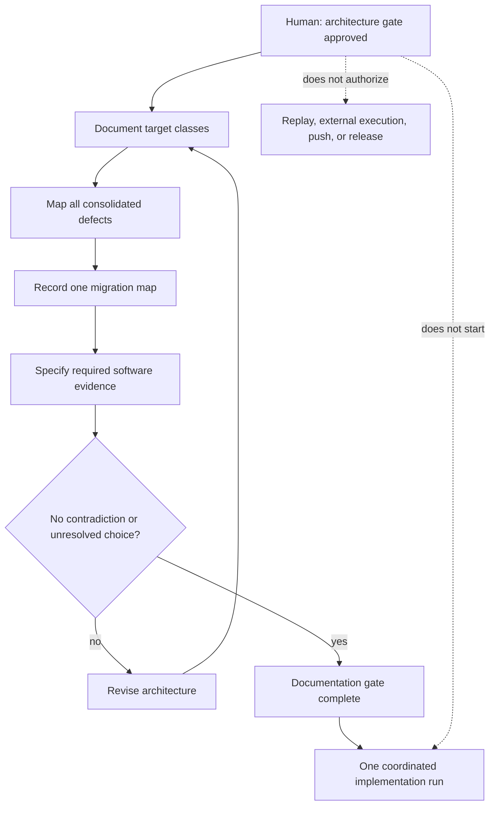
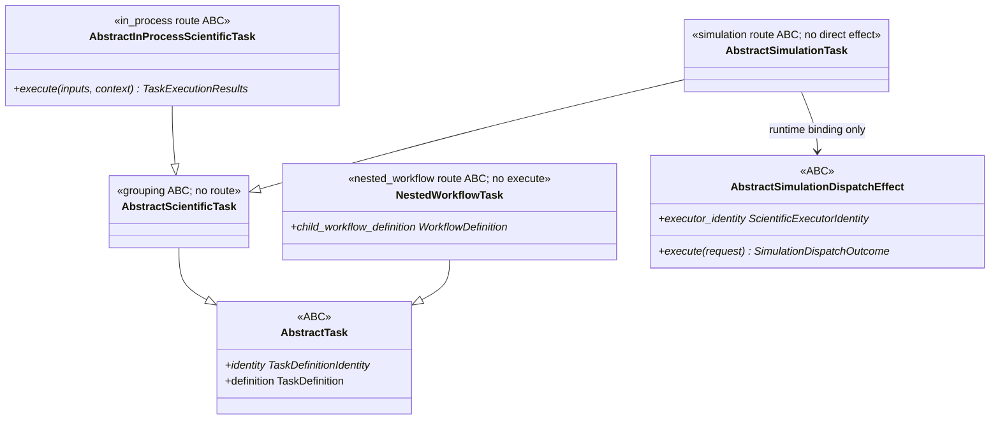
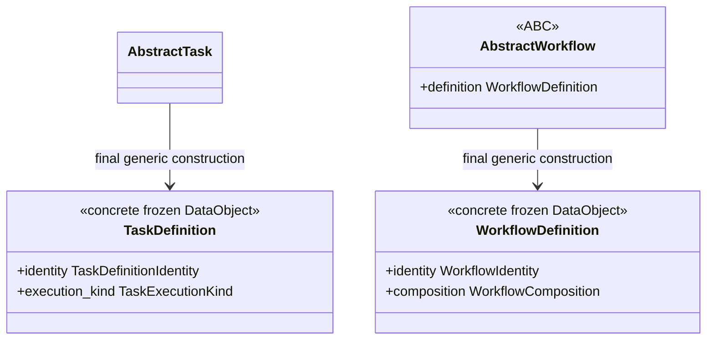
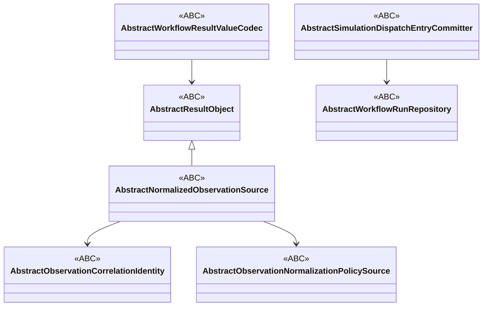
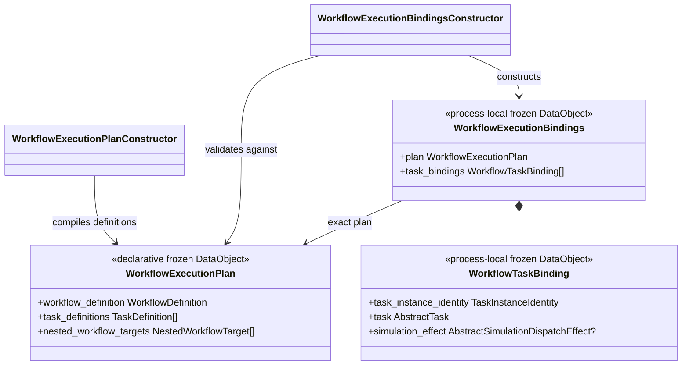
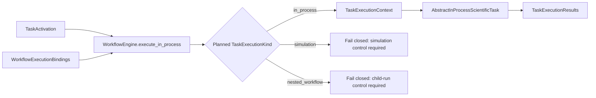
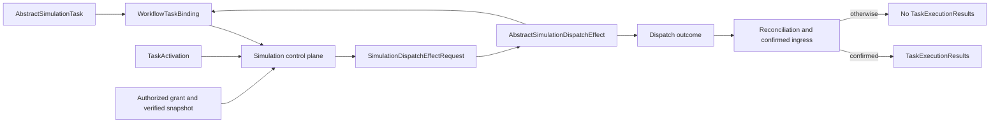
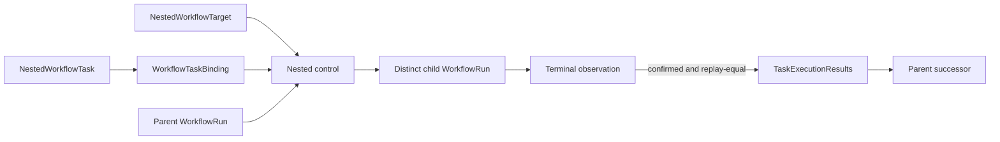
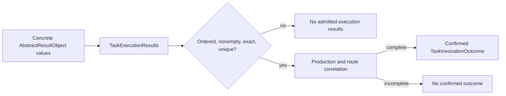

# Scientific Workflow schematic

## Status

**Nominal-ABC implementation is locally software-verified; independent implementation review found no blocking findings.**

These diagrams represent the accepted Workflow class contracts, not current source
signatures. The repository-wide decision requires every remaining structural Protocol
to migrate to a nominal ABC; the expanded documentation gate is complete, but the
coordinated source migration has not started.

## Architecture gate

The verbatim decision and bounded interpretation are retained in the
[architecture-gate record](../workflows/architecture-gate.md).

## Nominal Task hierarchy

`AbstractTask` rejects multiple route roots and route or definition overrides.
`AbstractSimulationDispatchEffect` inherits directly from `ABC`; no evidence supports a
generic dispatch-effect base.

## Generic definitions

Concrete operations and Workflows add no definition subclasses or schemas.

## Nominal result, observation, and persistence boundaries

Every implementation inherits nominally. Structural lookalikes, virtual registration,
and aliases for retired Protocol names are unsupported.

## Declarative plan and runtime bindings

The declarative plan contains no live adapter. Runtime bindings are explicit and
complete but are not declarative persistence or scientific provenance.

## In-process execution

The in-process method neither authorizes simulation nor executes child members.

## Simulation authority path

Only the authority-bearing effect request reaches external execution.

## Nested Workflow path

## Result and durable-outcome boundary

`TaskExecutionResults` establishes shape only. Durable confirmation retains authority,
production, activation, attempt, artifact, and route evidence with their existing
owners.

## Periodic-1D boundary

The periodic-1D Workflow remains paused. Its future in-process Tasks may be defined only
after the coordinated architecture migration and evidence gate complete. No replay is
authorized by this schematic.
