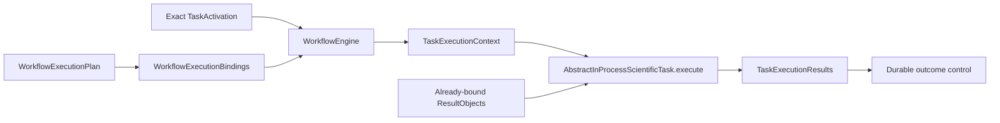

# `AbstractInProcessScientificTask` schematic

The engine receives only the activation and validated bindings. It reads the plan
contained by those bindings and reaches this method only when the plan snapshot,
runtime binding, and fixed `in_process` route agree. Neither the activation nor context
grants external execution authority.
