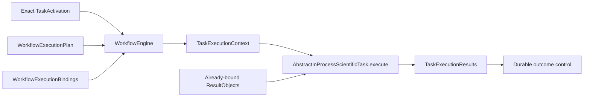

# `AbstractInProcessScientificTask` schematic

The engine reaches this method only when the plan snapshot, runtime binding, and fixed
`in_process` route agree. Neither the activation nor context grants external execution
authority.
