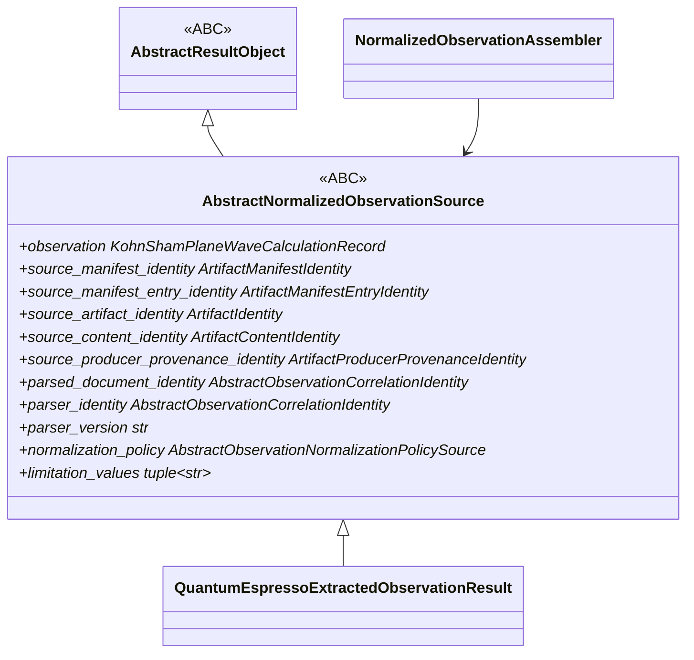

# `AbstractNormalizedObservationSource` schematic

```mermaid
classDiagram
    class AbstractResultObject {
        <<ABC>>
    }
    class AbstractNormalizedObservationSource {
        <<ABC>>
        +observation KohnShamPlaneWaveCalculationRecord*
        +source_manifest_identity ArtifactManifestIdentity*
        +source_manifest_entry_identity ArtifactManifestEntryIdentity*
        +source_artifact_identity ArtifactIdentity*
        +source_content_identity ArtifactContentIdentity*
        +source_producer_provenance_identity ArtifactProducerProvenanceIdentity*
        +parsed_document_identity AbstractObservationCorrelationIdentity*
        +parser_identity AbstractObservationCorrelationIdentity*
        +parser_version str*
        +normalization_policy AbstractObservationNormalizationPolicySource*
        +limitation_values tuple~str~*
    }
    class QuantumEspressoExtractedObservationResult
    class NormalizedObservationAssembler

    AbstractResultObject <|-- AbstractNormalizedObservationSource
    AbstractNormalizedObservationSource <|-- QuantumEspressoExtractedObservationResult
    NormalizedObservationAssembler --> AbstractNormalizedObservationSource
```
