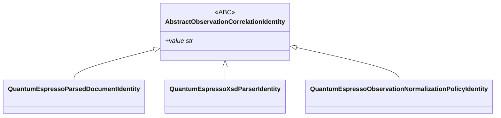

# `AbstractObservationCorrelationIdentity` schematic

```mermaid
classDiagram
    class AbstractObservationCorrelationIdentity {
        <<ABC>>
        +value str*
    }
    class QuantumEspressoParsedDocumentIdentity
    class QuantumEspressoXsdParserIdentity
    class QuantumEspressoObservationNormalizationPolicyIdentity

    AbstractObservationCorrelationIdentity <|-- QuantumEspressoParsedDocumentIdentity
    AbstractObservationCorrelationIdentity <|-- QuantumEspressoXsdParserIdentity
    AbstractObservationCorrelationIdentity <|-- QuantumEspressoObservationNormalizationPolicyIdentity
```
