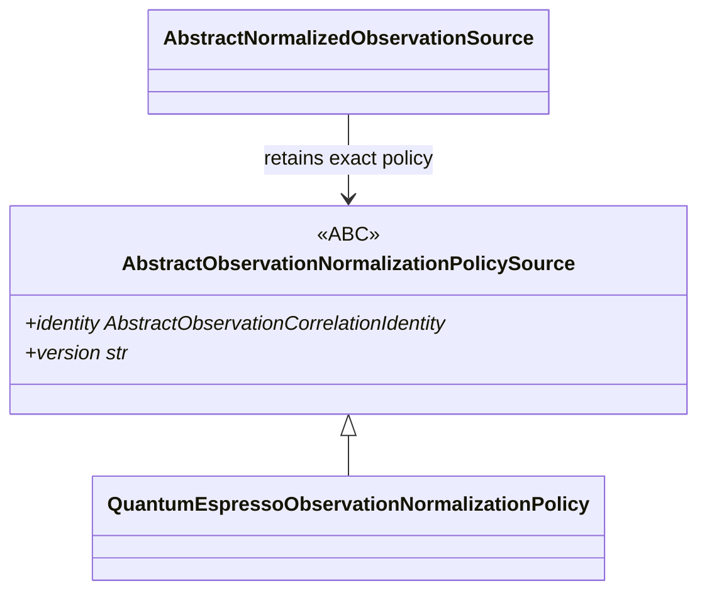

# `AbstractObservationNormalizationPolicySource` schematic

```mermaid
classDiagram
    class AbstractObservationNormalizationPolicySource {
        <<ABC>>
        +identity AbstractObservationCorrelationIdentity*
        +version str*
    }
    class QuantumEspressoObservationNormalizationPolicy
    class AbstractNormalizedObservationSource

    AbstractObservationNormalizationPolicySource <|-- QuantumEspressoObservationNormalizationPolicy
    AbstractNormalizedObservationSource --> AbstractObservationNormalizationPolicySource : retains exact policy
```
