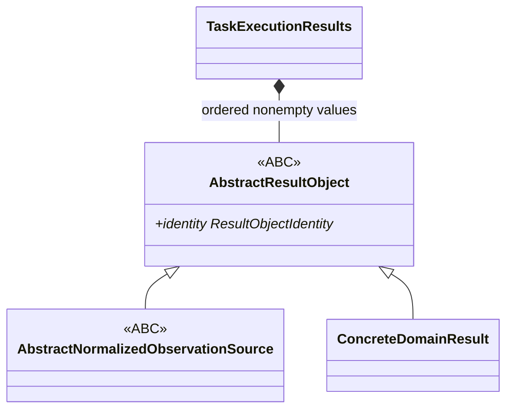

# `AbstractResultObject` schematic

```mermaid
classDiagram
    class AbstractResultObject {
        <<ABC>>
        +identity ResultObjectIdentity*
    }
    class AbstractNormalizedObservationSource {
        <<ABC>>
    }
    class TaskExecutionResults
    class ConcreteDomainResult

    AbstractResultObject <|-- AbstractNormalizedObservationSource
    AbstractResultObject <|-- ConcreteDomainResult
    TaskExecutionResults *-- AbstractResultObject : ordered nonempty values
```

The inheritance edge is nominal software membership, not evidence of production,
persistence, numerical verification, or scientific validation.
