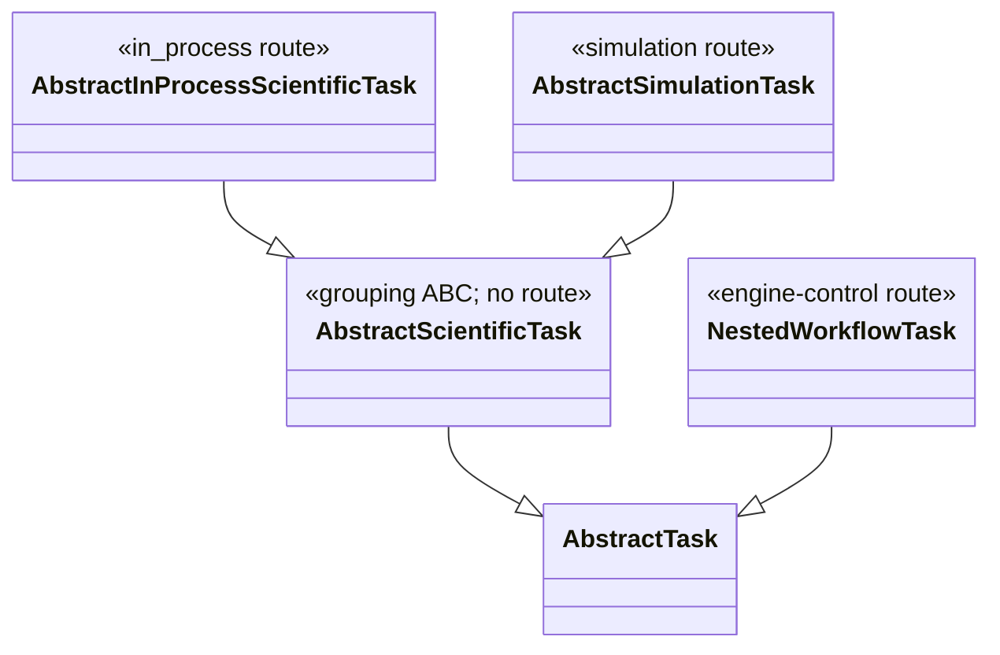

# `AbstractScientificTask` schematic

```mermaid
classDiagram
    class AbstractTask
    class AbstractScientificTask {
        <<grouping ABC; no route>>
    }
    class AbstractInProcessScientificTask {
        <<in_process route>>
    }
    class AbstractSimulationTask {
        <<simulation route>>
    }
    class NestedWorkflowTask {
        <<engine-control route>>
    }

    AbstractScientificTask --|> AbstractTask
    AbstractInProcessScientificTask --|> AbstractScientificTask
    AbstractSimulationTask --|> AbstractScientificTask
    NestedWorkflowTask --|> AbstractTask
```

The common scientific base expresses nominal meaning only. Route-specific descendants
own the distinct execution or dispatch boundaries.
