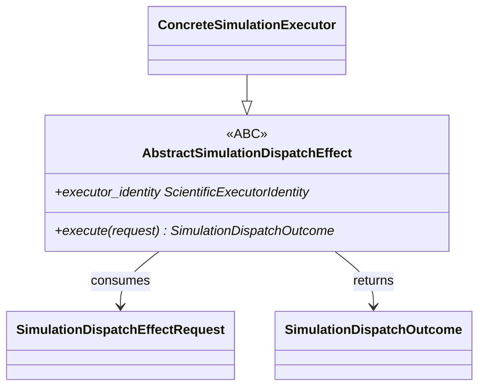
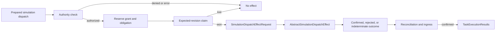

# `AbstractSimulationDispatchEffect` schematic

The nominal effect ABC is the only external-execution method. The simulation Task and
its runtime binding do not bypass the authority-bearing request.
