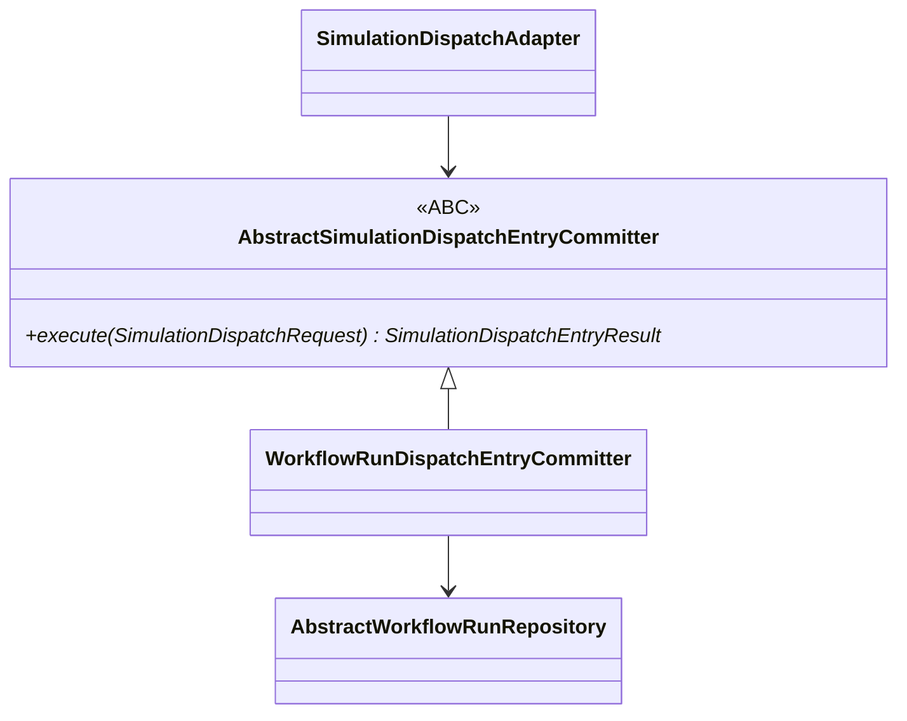

# `AbstractSimulationDispatchEntryCommitter` schematic

```mermaid
classDiagram
    class AbstractSimulationDispatchEntryCommitter {
        <<ABC>>
        +execute(SimulationDispatchRequest) SimulationDispatchEntryResult*
    }
    class WorkflowRunDispatchEntryCommitter
    class SimulationDispatchAdapter
    class AbstractWorkflowRunRepository

    AbstractSimulationDispatchEntryCommitter <|-- WorkflowRunDispatchEntryCommitter
    SimulationDispatchAdapter --> AbstractSimulationDispatchEntryCommitter
    WorkflowRunDispatchEntryCommitter --> AbstractWorkflowRunRepository
```

Committing a dispatch entry records control state; it does not itself authorize or
perform the external effect.
