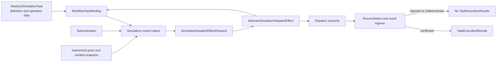

# `AbstractSimulationTask` schematic

```mermaid
flowchart LR
    task[AbstractSimulationTask<br/>definition and operation data] --> binding[WorkflowTaskBinding]
    effect[AbstractSimulationDispatchEffect] --> binding
    activation[TaskActivation] --> control[Simulation control plane]
    binding --> control
    authority[Authorized grant and verified snapshot] --> control
    control --> request[SimulationDispatchEffectRequest]
    request --> effect
    effect --> outcome[Dispatch outcome]
    outcome --> ingress[Reconciliation and result ingress]
    ingress -->|confirmed| results[TaskExecutionResults]
    ingress -->|rejected or indeterminate| none[No TaskExecutionResults]
```

There is no direct edge from `AbstractSimulationTask` to an external effect. The
control plane is the only authority-bearing invocation path.
