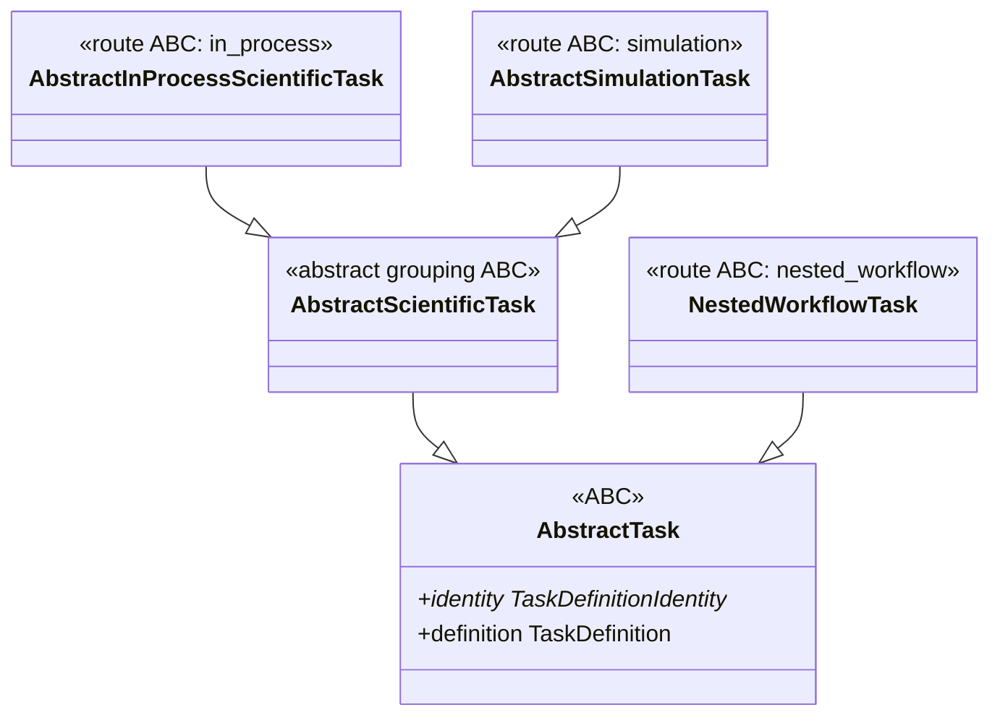
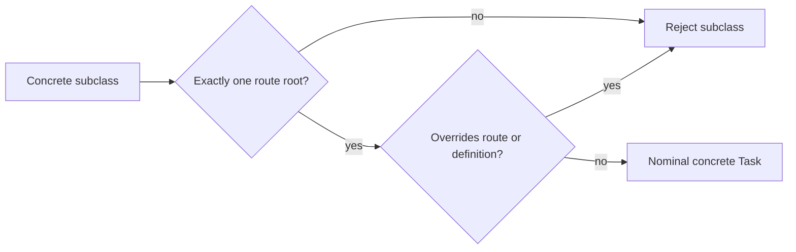

# `AbstractTask` schematic

```mermaid
classDiagram
    class AbstractTask {
        <<ABC>>
        +identity TaskDefinitionIdentity*
        +definition TaskDefinition
    }
    class AbstractScientificTask {
        <<abstract grouping ABC>>
    }
    class AbstractInProcessScientificTask {
        <<route ABC: in_process>>
    }
    class AbstractSimulationTask {
        <<route ABC: simulation>>
    }
    class NestedWorkflowTask {
        <<route ABC: nested_workflow>>
    }

    AbstractScientificTask --|> AbstractTask
    AbstractInProcessScientificTask --|> AbstractScientificTask
    AbstractSimulationTask --|> AbstractScientificTask
    NestedWorkflowTask --|> AbstractTask
```

```mermaid
flowchart LR
    subclass[Concrete subclass] --> roots{Exactly one route root?}
    roots -->|no| reject[Reject subclass]
    roots -->|yes| overrides{Overrides route or definition?}
    overrides -->|yes| reject
    overrides -->|no| accepted[Nominal concrete Task]
```

The grouping ABC does not supply a route. Only a route root makes a concrete Task
eligible for runtime binding.
