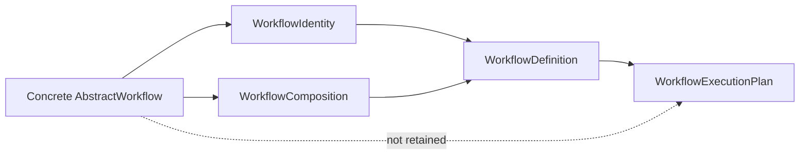

# `AbstractWorkflow` schematic

```mermaid
flowchart LR
    owner[Concrete AbstractWorkflow] --> identity[WorkflowIdentity]
    owner --> composition[WorkflowComposition]
    identity --> definition[WorkflowDefinition]
    composition --> definition
    definition --> plan[WorkflowExecutionPlan]
    owner -. not retained .-> plan
```

The final generic definition construction snapshots the reusable identity and
composition. Execution and represented run state remain outside the Workflow owner.
